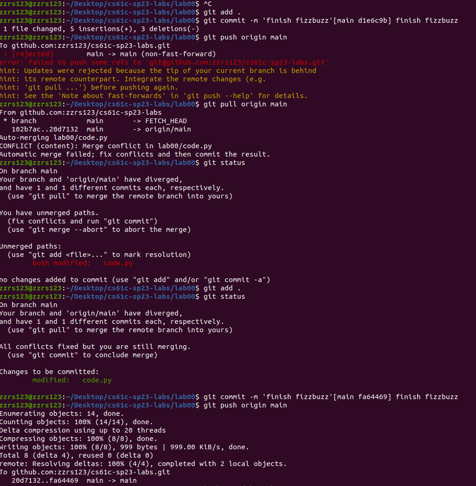
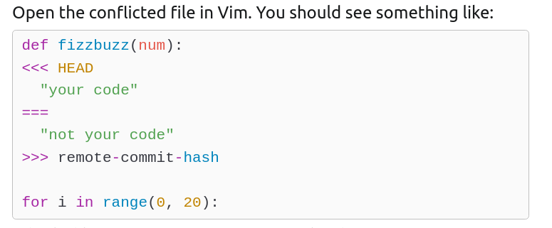

# CS61C sp23 Lab全记录

## Lab00：环境配置

这个实验本身很简单，但复杂性在于适应国外课程的要求和规则（毕竟是本人听的第一门国外名课），有的时候找资源、找方式都会很浪费时间（深有体会，希望入门之后能快一点）。

> - 完成时间：2023年3月7日18点
>
> - 简述：下午就在做，本身做的是CS61C的fa21版本，但是克隆下来，lab00的code怎么看都没有问题（实验就是要找问题），才发现已经是有答案的版本了，一怒之下决定切换到最新的sp23。
>
>   其实我也有点着急了，回退版本也可以做到原汁原味的lab。不过做最新的也有好处。跟进潮流吧，虽然听不到sp23的视频课，但我觉得听fa21也可以，翻了一下sp23的课件，跟fa21大致相同。之后要是时间紧张就切换回fa21或者22版本。

下面讲解一下这个实验。

首先是[实验地址](https://cs61c.org/sp23/labs/lab00/)，要注意实验说明上的很多服务因为不是本校生，都无法使用。比如Exercise 1&&3 可以整体略过，2在安装软件，4在介绍Github，比较简单不再概述。

主要动手的部分还是Exercise 5，记录几个点：

1. ```bash
   git clone git@github.com:61c-student/sp23-lab-USERNAME.git labs
   ```

   常规 `git clone xxxx`之后加上`folder_name`可以命名本地仓库

2. `git remote -v`查看远端仓库，此时肯定只有我的远端仓库，为了避免cs61c-tech的原仓库更新，所以要把原仓库加进来：

   ```bash
   git remote add starter https://github.com/61c-teach/sp23-lab-starter.git
   # git remote + [short-name] +[repo-url]
   ```

   这样更新原仓库的代码就是：

   ```bash
   git pull starter main
   ```

3. 有关`ls` 命令的花里胡哨用法，`..`表示父文件夹，所以可以直接在当前文件夹下查看父文件夹甚至home文件夹的目录：

   ```bash
   ls 
   ls ..
   ls ../..
   ```

4. fizz&&buzz代码fix：

   init.sh之后修改代码。很简单，但我不明白为什么要将num强制类型转换为str，我写的如下：

   ```python
   def get_airspeed_velocity_of(unladen_swallow):
     if unladen_swallow.type == "african":
       return # redacted
     elif unladen_swallow.type == "european":
       return # redacted
   
   def fizzbuzz(num):
     if str(num) in ["15"]:
       print(f"{num}: fizzbuzz")
     elif str(num) in ["3", "6", "9", "12", "15", "18"]:
       print(f"{num}: fizz")
     elif str(num) in ["5", "10", "15"]:
       print(f"{num}: buzz")
   
   for i in range(1, 20):
     fizzbuzz(i)
   ```

   Python过于简单。

5. 修改完之后推送代码遇到问题：

   

   这个问题实验手册上已经提到了，并且解读的很好。可以看到我的解决办法就是直接pull，然后再add并commit。

   今天我更清楚的了解了是怎么回事，是远端的commit与本地的commit冲突了。这时候pull远端，就将本地没有的冲突代码也拉到本地，这时git会尝试进行自动合并，而如果不能auto-merging，在本地代码中会显示冲突的部分，此时需要进行人为修改。

   

6. 之后就是创建debug.txt和下载 Logisim and Venus。有关提交我觉得就到自己的repo应该就到头了，autograde工具是不对校外学生开放的。

7. 一些Vim用法。不用vim。学了也会忘记。


## Lab01：