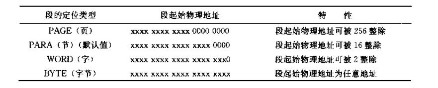
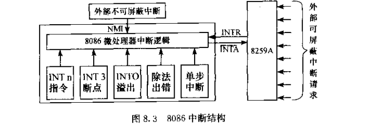
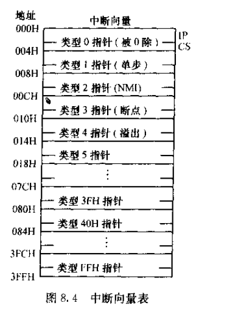
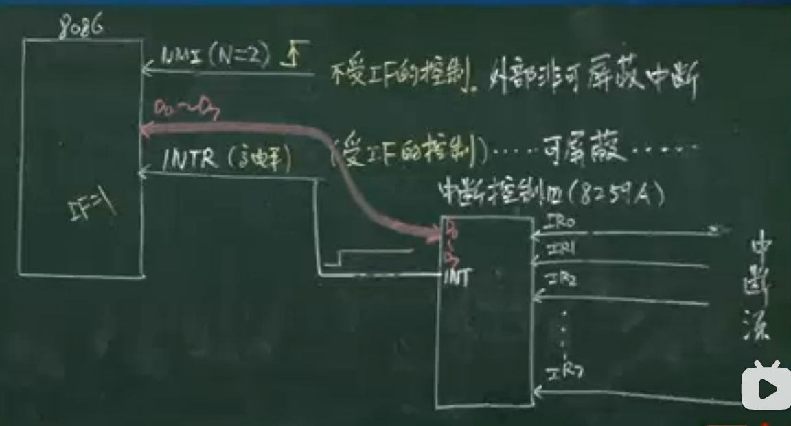
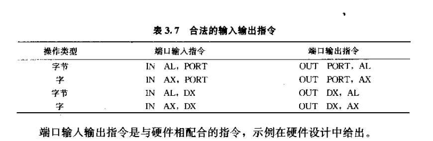

# 微机原理与系统设计笔记4 | 汇编语言程序设计与其他指令

------

- 打算整理汇编语言与接口微机这方面的学习记录。本部分介绍汇编语言程序设计以及一些跟程序设计密切相关的指令类。

- 参考资料
  - 西电《微机原理与系统设计》周佳社
  - 西交《微机原理与接口技术》
  - 课本《汇编语言与接口技术》王让定
  - 小甲鱼《汇编语言》

------

## 1. 汇编程序结构/框架

- 段定义伪指令

  程序不同的信息要定义在不同的段中，该指令就

  ```assembly
  SEGNAME SEGMENT [定位类型][组合类型]['类别']
  	;段实体
  SEGNAME ENDS
  ```

  - 这里要注意首尾一致，也就是SEGNAME要一样。
  - 有SEGMENT就要有ENDS，像C语言大括号一样。
  - 定义了一个段名SEGNAME，就具备了段地址属性。

  **定位类型**是告诉汇编器这个逻辑段起始地址的要求，取值有：

  

  常用是PARA 节型。

  **组合类型**是多模块程序设计中告诉链接器器，不同模块中同段名同组合类型的逻辑段如何链接。
  
  > 课程只要求单模块编程，所以组合类型不了解也罢。
  
  老师这里提了STACK型（说明本段是堆栈段），例子：
  
  ```assembly
  STACK SEGMENT STACK
        DB 256 DUP(?)
  STACK ENDS	
  ```
  
  注意这里第一行的第二个STACK声明为组合类型后，就不需要在代码段设置SS和SP了，如果不写这个组合类型声明，代码段还是需要声明。
  
  另一个组合类型是NONE类型，缺省型。其他的暂且不提。
  
  **类别**，如果要写，需要加上单引号说明，只告诉程序员这个段是干什么的，类似于段前注释，没有其他用处。


## 2. 8086汇编程序完整结构

```assembly
;定义堆栈
STACK SEGMENT STACK
      DB 256 DUP(?)
      ;定义堆栈段，找16可以整除的，SP = 栈底+1
TOP LABEL WORD 
;TOP为变量名；TOP 不占用内存位置，获取SP的地址；LABEL伪指令只有存储单元地址、类型属性但是不占内存位置
STACK ENDS

;定义数据段（可能有多个）
DATA SEGMENT 
;实体

DATA ENDS
X_BYTE LABLE BYTE;这样就可以直接使用34H这个字节型变量X_BYTE，而不用对X_WORD进行类型转换。
X_WORD DW 1234H
;定义代码段
CODE SEGMENT 
ASSUME CS:CODE,DS:DATA,ES:DATA;段寻址伪指令，告诉汇编程序段名和段的关系
ASSUME SS:STACK
;这种关系是承诺关系，并没有向这些寄存器赋值，还需要再赋值

START:MOV AX,DATA
      MOV DS,AX;数据初始化,不能直接DATA给DS
	  MOV ES,AX
  /*  MOV AX,STACK
	  MOV SS,AX 
	  MOV SP,OFFSET TOP*/
	  ;相当于STACK组合类型的作用
/*    MOV AH,4CH
      INT 21H */   
      ;DOS系统的4CH对应的中断子程序，此处是结束用户程序返回操作系统
CODE ENDS;代码段结束
END START(CS:IP);整个程序结束
;初始化CS，ip，放置这段代码。其实是交给OS来做了，用户无权。
```


## 3. 其他伪指令

上面的完整程序结构中已经提了很多伪指令，简单提一提其他伪指令。

- EQU 和 = 伪指令

  ```assembly
  VAR_NAME EQU/= Exp;给表达式赋一个名称
  ;用EQU定义时，这个VAR_NAME只能EQU定义一次，用=定义则可以再次定义
  ```

- ORG伪指令

  ```assembly
  ORG 表达式
  ```

  为后续指令指定段内偏移地址，可以人为使字型数据对齐。
  
  举个例子：操作系统中的boot.asm中对于 `org07c00h`是这样注释的：“告诉编译器程序加载到7c00h处”：
  
  ```assembly
  org 07c00h
  ;告诉编译器程序加载到7c00h处
  mov ax,cs
  mov ds,ax
  mov es,ax
  
  call screen
  jmp $
  
  screen:mov ax,bootmsg
  mov bp,ax
  mov cx,16
  mov ax,01301h
  mov bx,000ch
  mov dl,0
  int 10h
  ret
  
  bootmsg:db'Hello OS world!' 
  times 510-($-$$) db 0 
  dw 0xaa55
  ```

> 想直接听后面的了，不想听前面的指令系统了，折磨。

## 4. 子程序设计及其调用返回指令

这部分是3.11和4.5合在一起讲，前者是子程序调用返回指令，后者是子程序程序设计。

**子程序/过程**就是汇编语言里的函数，将一些功能性、重复性的代码放到子程序中调用，可以让自己的代码更加清晰。我们需要在主干代码**调用**子程序，在子程序结束时**返回**。

### 4.1 子程序指令

- 子程序定义：

  以过程形式定义：

  ```assembly
  son_name1 PROC [类型] 
  	;主体
  	RET;子程序返回，段间子程序可以用RETF
  son_name1 ENDP
  ```

    上面代码中的[类型]：

  - 段内子程序：NEAR，可以缺省
  - 段间子程序：FAR，不能缺省

  以标号形式定义（比较方便）：

  ```assembly
  LABEL:
  	;主体
  	RET
  ```

- 子程序调用与返回

  - 段内子程序调用与返回

    ```assembly
    CODE SEGMENT
         ASSUME CS:CODE
    START:
    
    	 ……
    	CALL SUB1;段内直接寻址
    	; call near sub1的near可以缺省
    	; ……CS不发生改变
    	
    	MOV AH,4CH
        INT 21H	
    	
    SUB1 PROC
    	RET
    SUB1 ENDP
    CODE ENDS 
    END START
    ```

    - 执行call时，IP放入堆栈（SP-2）字单元；
    - IP+DISP（到跳转标号的相对位移）得到新的IP；
    - RET 执行后，栈顶弹出放回IP，SP+2；

  - 段间子程序调用与返回

    ```assembly
    CODE1 SEGMENT
         ASSUME CS:CODE1
    START:
    
    	 ……
    	CALL FAR PTR SUB1;段内直接寻址
    	 ;……CS:IP(CS和IP都要保存)
    	
    	MOV AH,4CH
        INT 21H	
    CODE1 ENDS
    
    CODE2 SEGMENT
    	ASSUME CS:CODE2
    SUB1 PROC FAR
    	……
    	RETF;也可以直接写为RET
    SUB1 ENDP; 子程序/过程结束指令
    CODE2 ENDS
    ```

    - 执行call时，cs先入栈(sp-2)，ip再入栈(sp-2)，
    - RET 时，完成CS IP出栈。
    - ！**这里注意一个事情**，在子程序内使用了堆栈push pop后，需要在最后复原至调用初，才能将子程序正确返回。


### 4.2 信息的保护和恢复

也就是主程序和子程序会复用一些寄存器和存储器单元，调用子程序时需要保存主程序的这些东西，这个过程在主程序或子程序中都可以进行，通常在子程序中进行。

### 4.3 主程序和子程序的参数传递

寄存器、存储器、堆栈都能传递参数。

至于怎么传递，其实就是一个程序设计者自己规定的过程，比如主程序将参数放到AX，子程序从AX来拿。在堆栈参数传递参数方式时，需要用到BP指针。

### 4.4 子程序说明文件

作为学生，这部分当然不写，了解一下吧。

1. 子程序名
2. 子程序功能
3. 入口参数与传递方式
4. 出口参数与传递方式
5. 子程序用到的寄存器

### 4.5 嵌套、递归、可再用

- 嵌套子程序设计时注意堆栈溢出
- 设计自上而下，调试自下而上，保证调用的程序无问题
- 递归子程序:自己调用自己，需要考虑出口条件
- 可再用是一种提醒，感觉子程序可再用有点**复杂**，要在一次调用还未结束时又调用该子程序，要注意正确返回。

这一节偏实践，纸上论道不可取。用到再说吧，个人汇编编程经验感觉子程序这部分不难，这是要保护信息恢复信息。可再入不大明白（那就尽量不设计）。

> 这里有几个子程序设计例程，我感觉还不错。例3.32、例3.33、例3.34。

## 5. 中断调用与返回

3.12，结合了一部分第8章中断系统的知识。

> 说实话，"中断" 这个词通过操作系统OS这个课已经比较了解了，这里从微机角度温习一下。
>
> 但感觉这部分讲的有点乱。

### 5.1 中断

- 中断：是CPU执行程序时，由于某个事件的发生，暂停当前正在执行的程序，去执行处理这个事件的中断服务程序，执行完毕后再返回原程序继续执行。

- 中断分为外部可屏蔽中断、外部不可屏蔽、内部中断（软件中断）。具体如下图：

  

- 为了识别中断形式并采取对应服务，CPU都编排了**中断类型号**，这个具体CPU要查手册。

  > 8086中：
  >
  > - 除法错：n=0
  >
  > - 单步中断：n=1
  >
  > - 断点中断：n=3
  >
  >   int 3指令可以临时替换原有的指令，叫做**设置断点**，程序执行到int 3时，会进入类型3的中断服务程序，可以在中断服务程序中读原执行环节，来观察哪里有问题，之后再返回原程序，继续执行。
  >
  > - int n
  >
  >   更泛指，比如DOS系统功能调用`INT 21H`

- 后续会学上图中的中断处理硬件，8259A。

### 5.2 中断向量

中断向量其实是中断服务程序的指针，存放中断服务程序的入口地址。



系统将中断向量组织成中断向量表（换算表），放置在存储器最低地址0000H开始的1024个单元。每个中断向量占4B:

- 入口地址的偏移地址在低2字节，段基址在高2字节。所以调用时也是对应交给IP和CS。

- 换算关系是：中断类型号*4就是该中断向量在中断向量表中的**开始地址**。
- 中断向量表在OS初始化时就设置了。在自己写操作系统时，可以设置这个表。

### 5.3 中断响应过程

#### A. 内部中断

- 中断调用指令: `INT n`

- CPU执行以下操作：

  1. 保护现场：PSW IP CS 入栈

  2. 清除 IF TF 标志（TF清0说明中断期间CPU不会再中断）

  3. 从中断向量表中取出中断向量给CS IP赋值。

     > 如果是外部硬件中断，不知道这个查表要用的n，CPU需要从外部硬件中获取中断类型号。

  4. 转到中断服务程序执行。

- 中断服务最后一句，中断返回：`IRET`，将IP CS PSW出栈。返回原程序。

#### B. 外部中断

再来说说外部中断的中断号获取：



- 简单先说一下上图的情况，是在说8086的中断引脚情况

- NMI不可屏蔽中断就不提了。

- INTR引脚：

  - 受IF中断标志位控制，**当IF=1时**，CPU执行完当前指令后，就会响应硬件中断；
  - 下面就是硬件中断的**响应过程**：
    1. 保护现场：PSW IP CS 入栈
    2. 清除 IF TF 标志（此时IF=0）
    3. CPU从外部中断控制器8259中获取中断号；
       - 首先需要CPU告诉8259，它现在响应了中断；即INTA引脚发出负脉冲给8259.
       - 其次CPU要问要响应哪个硬件中断，即再次发出INTA负脉冲给8259（第二次）
       - 8259收到后将内部寄存器存储的N值送到数据线。N不固定。
    4. 根据拿到的N，从中断向量表中取出中断向量给CS IP赋值。
  - IRET中断返回。

- 只有一个8259则只能控制8个硬件，可以采用**8259级联的方式**来增加控制硬件数。

  这里可以算控制硬件个数，但是不难。

### 5.4 中断程序结构/框架

中断很像子程序，但是有所不同，因为中断随时可能发生，自己写的主程序无法预料何时发生中断，所以中断程序内部开始时应当有**保护现场操作**，返回时有**恢复现场操作**。

```assembly
INT_NAME:
	PUSH AX ;保护现场操作
	;......
	PUSH SI
	
	; 主体
	; ...
	POP SI ;恢复现场操作
	POP AX
	IRET ;中断返回
```

### 5.5 系统调用

系统调用分为两类

- BIOS功能调用，这部分主要是操作硬件。
- DOS功能调用，讲道理这是操作系统提供的服务，偏向软件。自己写的OS可以自行设计功能调用。8086汇编主要面向DOS操作系统（这点是过时的地方...）。

#### A. DOS功能调用

DOS系统功能调用的方法一般可分为以下几步：

1. 设置所要调用功能的入口参数。
2. 在AH寄存器中存入所要调用功能的功能号。
3. `INT 21H`指令自动转入中断子程序入口。
4. 相应中断子程序运行完毕，可按规定取得出口参数。

常用的DOS功能调用有 `INT 21H`，AH里放参数决定具体服务（如果需要参数），比如放入**01H**就是**等待用户从键盘输入一个字符**，回显，按键的ASIIC码放到AL中。

> 补充一个小知识：
>
> - ASCII数字如何得到数字:
>
>   ```assembly
>   AND AL,0FH;消除高位即可
>   ```

这里举了一个键盘按键并回显的例程，跳转表法，挺巧妙的，老师讲了两个跳转表法的实现方式，第一个是在课本4.25，第二个就是将跳转表定义到了代码段。

> 其他的不再写了，主要就是设置参数，设置调用号再辅以子程序实现相应的功能：
>
> - 02H向屏幕输出一个字符
> - 06H 控制台输入、输出
> - 09H 向屏幕输出一串字符（字符串数据变量定义时**必须要有结束符 '$'**）
>
> DOS与BIOS 系统调用一览：https://blog.csdn.net/icurious/article/details/51628343

0AH 从键盘输入一串字符（有等待功能，键盘输入回车时结束输入并显示），此时必须有键盘缓冲区（存储器中）：

```assembly
DATA  SEGMENT
……
    KEYbuf1 DB 20H;允许用户输入的字符个数
	        DB ？;用来统计实际输入的字符数
	KEYbuf2 DB 20H DUP(?);存放实际输入的字符串
    ;键盘输入缓存区
DATA ENDS
CODE SEGMENT 
     ASSUME CS:CODE,DS:DATA
START:
     MOV AX,DATA
	 MOV DS,AX
	 ……
	 ;从键盘输入一串字符，有回显
	 MOV AH,0AH
	 MOV DX,OFFSET KEYbuf1
	 INT 21H
......
```

> 课后题4.39题回头看看。

显示系统时间：(这里是DOS系统调用获取，当然也可以用cmos获取--**王爽汇编实验14**，不过还没有讲到与外设交互)

```assembly
;返回值：CX = year (1980-2099) DH = month DL = day AL = day of week (00h=Sunday)
data segment
data ends
 
code segment
        assume ds:data, cs:code
 
main:
        mov ax, data
        mov ds, ax
 
        mov ah, 2ah
        int 21h
 
        mov ah, 4ch
        int 21h
code ends
end main
```


#### B. BIOS 功能调用

- 00H 设置显示器,清屏功能

  ```assembly
  MOV AH,00H
  MOV AL,3;彩色文本，且大小是80X25
  MOV BX,0;页数，与显卡数据缓存区有关
  INT 10H
  ```

- 02H 设置光标位置

  ```assembly
  MOV AH,02H
  MOV DH,行
  MOV DL,列
  MOV BL,0
  INT 10H
  ```

## 6. 字符串操作指令

对传送指令再升级，对一组数据进行整体操作。

1. 源字符串和目的字符串均为隐含寻址

   - 如果源串在存储器中，则存储器的的地址在DS:SI；

     若源串在REG中，字节：AL，字：AX

   - 目的字符串，必须在ES:DI（必须对应）

     在REG同上

2. 如果源串目的串在存储器中，则CPU执行时，SI、DI的地址会自动改变，这个改变受DF的控制：

   - DF=0时, +;

   - DF=1时, -;

     > 这里在编程时需要向其赋值确保其值。如确保DF==0: `CLD`

   - ± 的程度受操作数类型大小的控制（放在头部或尾部）：若为字节操作自动+1/-1，若为字操作自动+2/-2

3. 在串操作指令的左边可以增加重复前缀，重复次数隐含放在CX中

   - REP前缀：等效于LOOP，放在MOOSB LODSW STOSB前
   - REPZ/REPE：等效于LOOPZ，放在CMPSB,SCASB之前，（相等重复）
   - REPNZ/REPNE：等效于LOOPNZ，放在CMPSW SCASB之前，（不相等重复）


- 串传送指令

  ```assembly
  MOVSB
  MOVSW
  ```

- 串比较指令

  ```assembly
  CMPSB
  CMPSW
  ```

  源字符串减去目的字符串（对应位置依次比较），设置状态寄存器

- 串扫描指令

  ```assembly
  SCASB
  SCASW
  ```

- 串装入指令

  ```assembly
  LOOSB
  LOOSW
  ```

- 串存贮指令

  ```assembly
  STOSB
  STOSW
  ```


### 6.1 字符串传送指令

三种书写格式：MOVSB、MOVSW，`MOVS DST,SRC`。

- 以MOVSB存储器操作为例：

  1. ES:DI<-- DS:SI

     > 源串段地址可以更改（如使用第三种书写格式），而目的串寄存器不可更改，见书P74页**ES段到ES段**的传送。

  2. SI和DI会自动+/-

  3. 若加上REP重复前缀，则执行第三步，CX-1->CX，若CX≠0，则重复执行MOVSB

     例题见P75 例3.36

     ```assembly
     DATA SEGMENT 
          BUFFER1 DB 100 DUP(?)
          BUFFER2 DB 100 DUP(?)
     DATA ENS
     CODE SEGMENT
          ASSUME CS:CODE,DS:DATA,ES:DATA
     START:
          MOV AX,DATA
          MOV DS,AX
          MOV ES,AX
          LEA SI,BUFFER1
          MOV DI,OFFSET BUFFER2
     	 CMP SI,DI
     	 //JB DZJXFX
     	 MOV CX,100
        /*CLD ;DF=0
     	 REP MOVSB	 字符串指令*/
     	 ;下面是数据指令完成的
     N1:	 MOV AL.[SI]
     	 MOV ES:[DI],AL
     	 INC SI
     	 INC DI
     	 LOOP N1
     	 MOV AH,4CH
     	 INT 21H
     CODE ENDS
     END STRAT
     ```

     若**源串和目的串重叠**，视情况正向搬运或者逆向搬运。（有两种情况:

     - 若源串起始地址比目的串起始地址高：SI DI增大方向搬
     - 低：SI DI 减小方向搬

### 6.2 字符串比较指令

CMPSB CMPSW `CMPS DST,SRC`

以CMPSW为例：（源减去目的，这与数据比较指令不同）

1. SRC-DST，也即是(DS:SI)-(ES:DI)，设置6个状态寄存器，若ZF==1，说明相等。

2. SI DI 自动+/- 2

3. 若有重复前缀REPZ，(CX-1)-->CX，若CX≠0且ZF=1，重复执行CMPSW

   若前缀REPNZ，则修改上面条件改为ZF=0即可：若CX≠0且ZF=0

例程在书P76 例3.37

```assembly
MOV SI,OFFSET BUFFER1
MOV DI,OFFSET BUFFER2
MOV CX,100
CLD
REPNZ CMPSW
JZ Find
MOV ADDR,0FFFFH
JMP EXIT

Find:SUB SI,2
MOV ADDR,SI
……
MOV AH,4CH
INT 21H
```


### 6.3 字符串扫描指令

SCASB、SCASW、`SCAS DST`，适用于在字符串中找某个字符或筛出某个字符。

以SCASB为例：

1. 源减去目的：AL-(ES:DI)，结果设置6个标志，主要是ZF，ZF=1，则找到
2. DI+/-1，没用到SI
3. 若有重复前缀REPNZ，(CX-1)-->CX，若CX≠0且ZF=0，重复执行SCASB；退出循环体可以测试ZF==1来判断找到。

### 6.4 字符串装入指令

LODSB LODSW，意为将源字符串（存储器中）读出到AL/AX中。

以LODSB为例：

1. AL<--(DS:SI)
2. (SI+/-1)-->SI

这里老师讲了两个计算机通信的例子，8250，emm，略去。

### 6.5 字符串存贮指令

STOSB STOSW STOS

以STOSB为例：

1. AL-->(ES:DI)
2. DI±1-->DI
3. 可以带REP重复前缀

例程P79 例3.39

```assembly
DATA SEGMENT 
    BUFFER1 DW 
    BUFFER2 DB	
DATA ENDS

CODE SEGMENT
    ASSUME CS:CODE,DS:DATA,ES:DATA
STRAT:
    LEA DI,BUFFER1
	MOV AX,0000H
	MOV CX,200
	CLD
    REP STOSW
    /*也可以改为
    L1：MOV ES:[DI],AX
    	INC DI
    	INC DI;字，所以减了两次
    	LOOP L1
    */
	LEA DI,BUFFER2
	MOV AL,55H
	MOV CX,256
	CLD
	REP STOSB
```

例子2，P112例4.7

## 7.输入输出指令、其他指令

输入输出指令针对I/O操作。

### 7.1 输入指令

格式：`IN DST, SRC`，这里SRC是端口地址（8086的前16根地址线寻址），

- 若端口地址在0~255之间，SRC可以采用直接寻址：

  ```assembly
  IN AL,端口地址
  ```

- 若端口地址>255，需采用间接寻址（都可以采用间接寻址）。

  ```assembly
  MOV DX,端口地址
  IN AL,DX;触发IO操作的地址寄存器
  ;符合语法，虽然DX没加括号，但是合法
  ;这里的意思比较抽象，就是地址放在DX中，in进来的内容放在AL中
  ```

上述所说是字节操作，若为字操作，则AL改为AX。

### 7.2 输出指令

格式：`OUT DST, SRC`，操作数交换一下，其他要求与输入完全一致。



- 输入输出指令要使用外部总线，一个总线周期包括4个基本的时钟周期，而输入输出指令包括了5个时钟周期，也就是输入输出指令工作时间要多一个周期T1、T2、T3、TW(多出的等待周期)、T4

> 这里老师举了一个外设操作例子（P61最后~P62），讲得很好，很整体，甚至包括了IO地址译码电路（控制信号也要参与译码d），但学到外设再说。

### 7.3 其他指令

> 这部分直接看书更快。

- 标志位处理指令，详见[笔记3的标志位处理指令（7个）](https://www.cnblogs.com/Roboduster/p/17098933.html#7-%E6%A0%87%E5%BF%97%E4%BD%8D%E6%93%8D%E4%BD%9C%E6%8C%87%E4%BB%A4)

- 处理器控制指令 5个

  - 空操作指令 NOP，什么也不做，占用机器3个时钟周期，用于延时、等待。

    看一个延时子程序（双层循环）：

    ```assembly
        MOV BX,3;一个值，外层循环的次数
    L2: MOV CX,0;65536
    L1: NOP
        LOOP
    	DEC BX
    	JNZ L2
    ```

  - 暂停指令 HLT，使CPU进入暂停状态，不再向下执行。退出条件：

    - RESET信号有效直接复位，或者NMI不可屏蔽中断。此时退出但也不会执行后续程序。

    - INTR可屏蔽中断发生，CPU保护当前程序现场（IP指针在hlt的下一句），保护了当前程序，返回后则继续执行后续程序。

      这个可以用于CPU跟外设的同步（用的不多）

  - WAIT等待指令，每隔5个时钟周期对TEST引脚状态进行测试，当TEST线低电平则退出等待，执行下一条指令。

### 7.4 宏指令

宏定义指令定义出来的自定义指令。宏指令必须在程序最开头定义。

```assembly
宏指令名 MACRO <形式参数>;参数多于1项，用逗号分隔
; ... ;指令或伪指令构成的宏体
ENDM ;宏定义指令结束，注意这里结束不需要写宏名
```

例子：

```assembly
;定义一条宏指令，将<某通用寄存器REG><左/右移><若干次>
SHIFT MACRO REG,DIR,N
      MOV CL,N
	  DIR REG,CL;或者:S&DIR REG,Cl
	  ; 因为 SHL,SHR,SAL,SAR 都以S开头
      ENDM
      
;某程序体中，将AX逻辑左移3次:宏调用如下:
SHIFT AX,HL,3
```

当汇编器汇编到这个宏调用时，会将前面的宏定义的形参替换掉，并插入此处（**宏展开**）。

宏调用和子程序都可以来放一个经常调用的功能模块，但区别在于：

- 宏调用每次调用就都将语句插入（宏展开），浪费空间，但节省调用时间（没有CALL和RET）。
- 子程序汇编后空间固定，所以节省空间，但浪费时间。

```assembly
;定义一条宏指令，完成光标回车换行
CRLF MACRO
     MOV AH,2
	 MOV DL,0DH
	 INT 21H
	 MOV AH,2
	 MOV DL,0AH
	 INT 21H
ENDM
```

一个值得研讨的点：当宏指令中有循环或分支，也就是有标号，主程序多次宏调用时，会提示标号重复：

- 此时应当将标号声明为 **局部标号**：` LOCAL NEXT`，汇编时自动分配不同标号。

  ```assembly
  ;数据块搬家
  DATAMOV MACRO DATA1,DATA2,N
          LOCAL NEXT;声明NEXT是局部标号
          LEA SI,DATA1
  		LEA DI,DATA2
  		MOV CX,N
  NEXT:	MOV AL,[SI]
  		MOV [DI],AL
  		INC SI
  		INC DI
  		LOOP NEXT
  		ENDM
  	; ……
  	; 主程序中的宏调用
  	DATAMOV buf1,buf2,100
  	;汇编展开;
  	; LOOP NEXT变为LOOP ??0000
  	; ......
  	DATAMOV buf3,buf4,200
  	;汇编展开
  	;LOOP NEXT变为LOOP ??0001
  ```


> 除了上面介绍的，还有**重复宏**，格式是:
>
> ```assembly
> ; 重复宏
> REPT <重复次数>:
> 	;重复程序体
> ENDM ; 也是以此结尾
> 
> ; 不定重复宏
> IRP <形参>, < <参数1>,<参数2>,...>
> 	;重复程序体
> ENDM ; 也是以此结尾
> 
> ;不定字符重复宏
> IRPC <形参>,<字符串>;将字符串中的各个字符依次赋给形参重复执行指定程序体
> ;重复程序体
> ENDM ; 也是以此结尾
> 
> IRPC CC,AAB
> 	ADD AX,CC&X
> ENDM
> /* 相当于
> 	ADD AX,AX
> 	ADD AX,AX
> 	ADD AX,BX
> */
> ```

## 8. 分支程序设计

- 单分支程序；多分支程序

- 要点1是分支条件：

  1. 某种运算产生条件
  2. 判断条件是否成立
  3. 根据条件产生分支

  多分支程序结构与上面几步类似，此外还可以通过跳转表来实现多分支

- 要点2是转移范围：

  - **条件转移**只能在当前IP的-128~+127之间转移

- 要点3是程序调试时要保证每个分支结果的正确性（因为单次调试可能只走了其中一条分支）

- 要点4：分支程序设计要点

  1. 正确选择分支条件，确定条件转移指令
  2. 编写程序时，要保证每个分支的正确性
  3. 调试时逐个分支调试

例子：书P112例4.7，两递增数组合并。

```assembly
STACK SEGMENT STACK 'STACK'
	DW 100H UP(?)
TOP LABLE WORD
STACK ENDS

DATA SEGMENT
DAT1 DW 10
	 DB 10H,25H,67H,73H,83H,95H,0A8H,0C2H,0E6H
DAT2 DW 13
     DB 05,12H,45H,58H,65H,67H,70H,76H,88H,92H,0CDH,0DEH

DAT DW ?
	DB 200 DUP(?)
DATA ENDS

CODE SEGMENT
	ASSUME CS:CODE,DS:DATA,ES:DATA,SS:STACK

START:
	; 一些初始化
	MOV AX, DATA
	MOV DS, AX
	MOV ES, AX
	MOV AX, STACK
	MOV SS, AX
	LEA SP, TOP
	; 计算 目标数组 大小
	MOV CX, DAT1
	MOV DX, DAT2
	MOV DAT, CX
	ADD DAT, DX
	; 置位三个指针，ES:SI,DS:BX,ES:DI
	LEA SI, DAT1+2
	LEA BX, DAT2+2
	LEA DI, DAT+2
	CLD
	
L1:
	MOV AL, [BX]
	INC BX
L2:
	CMP AL,[SI]
	JB L3; AL<[SI]，去L3
	; AL>=[SI]，向下执行
	MOVSB
    DEC CX ;控制循环次数，DAT1数组是否比较完成
    JZ L4 ;结束
    JMP L2 ;无条件循环L2
L3：
	STOSB ;DAT2区数据传送到DAT
	DEC DX
	JZ L5	;如果两边数组有剩余
	JMP L1
L4： 
	MOV SI,BX
	DEC SI
	MOV CX,DX
L5：
	REP MOVSB
	MOV AH,4CH
	INT 21H
CODE ENDS
     END START
```


## 9. 循环程序设计

- 循环程序组成

  1. 初始化部分
  2. 循环工作部分
  3. 循环参数调整
  4. 循环出口判定，返回2或者继续到5
  5. 结果处理/出口

- 例程，**气泡排序法程序**：书P108页例4.5

  核心代码：

  ```assembly
  ; 初始化部分
  MOV CH,N-1;外层
  NEXT2:
  	MOV CL,CH; 内层
  	LEA SI,BUF1; 数组首址
  	MOV BL,0; 交换标志
  
  ; 循环工作
  NEXT1:
  	MOV AL,[SI]
  	CMP AL,[SI+1]
  	JAE NOCHG	;AL>=[SI+1]不交换
  ;否则交换
  	XCHG AL,[SI+1]
  	MOV [SI],AL
  	MOV BL,-1 ;有交换，说明未排完
  
  NOCHG:
  	; 调整循环条件并判定出口
  	INC SI;
  	DEC CL
  	JNZ NEXT1 ;未到0继续内层交换
      ;否则继续外层循环
      CMP BL,0;是否已经排好序
  	JZ EXIT ;如果排好序则退出
  	DEC CH	
  	JNZ NEXT2
  
  EXIT: MOV AH,4CH
        INT 21H
  ```

警惕程序挖空填写题。


