# 微机原理与系统设计笔记5 | 总线及其形成

------

- 打算整理汇编语言与接口微机这方面的学习记录。本部分介绍8086的总线。

- 参考资料
  - 西电《微机原理与系统设计》周佳社
  - 西交《微机原理与接口技术》
  - 课本《汇编语言与接口技术》王让定
  - 小甲鱼《汇编语言》

------

## 1. 总线定义与分类

> 讲道理这部分学校老师不强调这个，尤其是引脚（说我们记不住），而视频里老师讲得很多。

总线是计算机系统中传输各类信息的公共通道。按照功能层次，有四类：

1. 片内总线

   连接集成电路芯片内部各个功能单元的信息通路。

2. 元件级总线（板内总线）

   连接同一个插板内各个元件的总线，类似于PCB板上的走线。

3. 内总线/系统总线（版级总线）

   连接各个插件板（微处理之间器、主存储器、I/O接口）之间的通路。PCI、ISA、STD总线就是这一层次。

   > 本章涉及也是这一层次的总线。

4. 外总线/通信总线（I/O总线）

   连接微机主体与I/O设备、仪表以及其他微机的总线。

> 视频里老师就讲到这里。课本上后面又讲解了几个系统总线，我对PCI比较感兴趣，操作系统课程设计也用到了这个总线。不过微机角度的PCI主要是结构、时序方面，对编程要求不大。

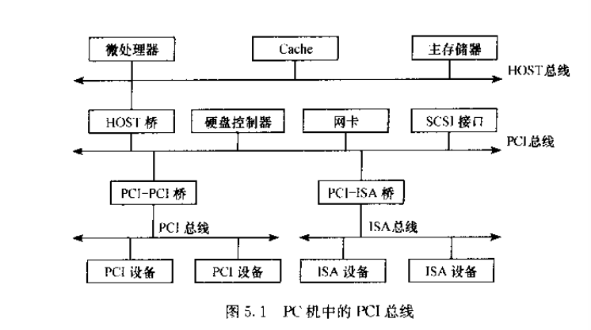

- 上图5.1是一个具备PCI总线的典型结构，里面有3个总线（HOST PCI ISA）以及3个桥设备
- HOST总线也称存储总线，连接微处理器、Cache、内存
- PCI总线连接高速I/O接口，因此这些设备也称为PCI设备
- HOST桥：也叫PCI总线控制器，连接HOST和PCI。
- PCI-PCI桥：扩展PCI总线。
- PCI-ISA桥：扩展接入标准，符合ISA的设备也可以接入系统。
- 桥设备的用处：
  - 地址空间映射
  - 数据缓冲，因为PCI总线基本是突发事件传送，没有缓冲，加上桥设备可以处理时序、流量等更多情况。
  - 实现不同层次总线的协议和电平转换。

## 2. 几种常用芯片

这块没学过，应该电信方面的数电学过，数字逻辑没有讲过。汇编这门课也没有讲（好像），不整理了。总而总之，这几个芯片是用于总线驱动、管理的封装好的电路。

### 2.1 74LS244

8位数据单向缓冲器。可用作输入端口的缓冲。

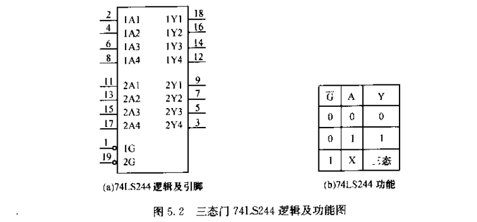

### 2.2 74LS245

8位数据双向缓冲器。可以用作总线连接的双向缓冲，也能当做74LS244来用（Dir接地，常0）。工程中也更常使用74LS245。

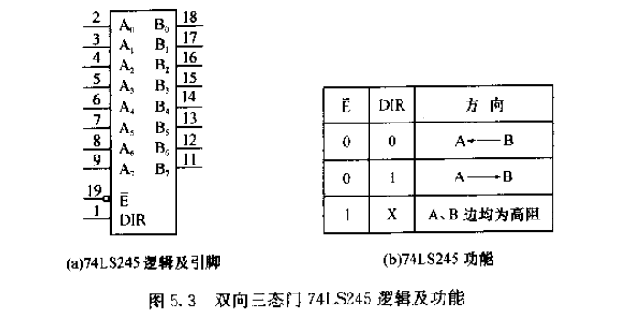

### 2.3 74LS373/74LS374

8位锁存器。常让OE接地==0。74LS374与之类似，只是G端变为CP时钟，时钟上升沿能够保持数据。

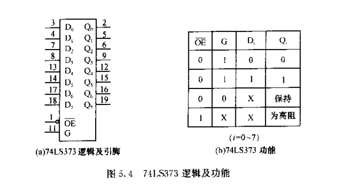

### 2.4 74LS138

就是一个3-8译码器。

三个使能端，分别接入1-0-0才能正常工作，A0~A2是输入端，输出Y1~Y7的8根线。使能端1-0-0后，当A2 A1 A0输入110，则输出端的Y6显示低电平。

## 3. 8086引脚功能以及总线形成

为什么又要说引脚呢？引脚就是微处理器级总线，微处理器 通过 微处理器级总线/引脚 与外面的IO电路连接，组成主机板系统，也就形成了系统级总线。

> 说实话这部分虽然打通数电微机和计组，但是，但这个角度比较难理解。从逻辑设计Verilog角度比较好理解时序，时序是人可以设计出来的，只不过到了8086微机中，Intel规定了一切。

- 整体上看，8086是40根引脚双列直插，部分引脚分时复用，有两种功能。电源电压为+5V±10%

  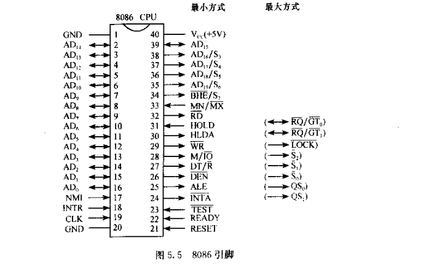

- RESET，复位信号，高电平有效。这里老师讲了8254时钟发生器，使得RESET和时钟上升沿一起到来（具体实现不关心了）。RESET信号的高电平有效至少要持续4T才能复位。

  复位后，DS、ES、SS、IP、PSW、指令队列寄存器都清0，CS=0FFFFH。所以启动地址cs:ip是**FFFF0H**，其他通用寄存器值不确定。

  > 对于FFFF0H，已经在内存的很高地址，所以接下来需要远程跳：`jmp far ptr xxxxh`，向低地址跳转。51单片机的复位中PC寄存器直接置0就没有这个问题。

- clk时钟输入引脚，8086的工作时钟<5MHZ。基本的总线周期是4个时钟周期，而非基本总线周期则是3个clk+1个等待周期。

- MN/MX fei：工作模式选择。加高电平--最小方式；加低电平--最大方式。两种方式不同的是上图中24~31脚。

  - 最小模式下，CPU对外部存储器、IO的读写等控制信号**由CPU直接产生**。适合构成单处理器系统。

  - 最大模式下，不由CPU直接产生，而由8086CPU外部的总线控制器芯片8288产生。CPU通过26、27、28引脚来控制8288，8288来**译码并产生**相应控制信号。适合构成多处理器系统。

    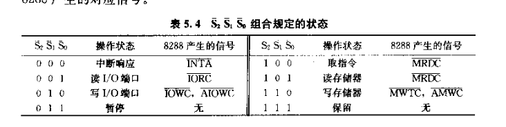

### 3.1 最小方式（重点）

- AD0~AD15、A16/S3~A19/S6：分时复用，地址线和存储器、IO的数据线；高四位地址线和状态线。

  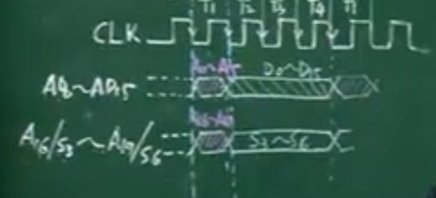

- ALE 地址锁存：在上图的T1周期内电位变高。变高就知道了上面最重要的T1已经到来。在拿到T1来到的信息后就可以拿到16位地址，可以用74LS373来存储。

  > 注意，这里已经开始和5.3节总线形成一起讲了。

  用ALE来作74LS373的G引脚，可以将地址信息锁存4周期。3片74LS373（总线形成电路）输出的A0~A19就是系统级的总线了。

  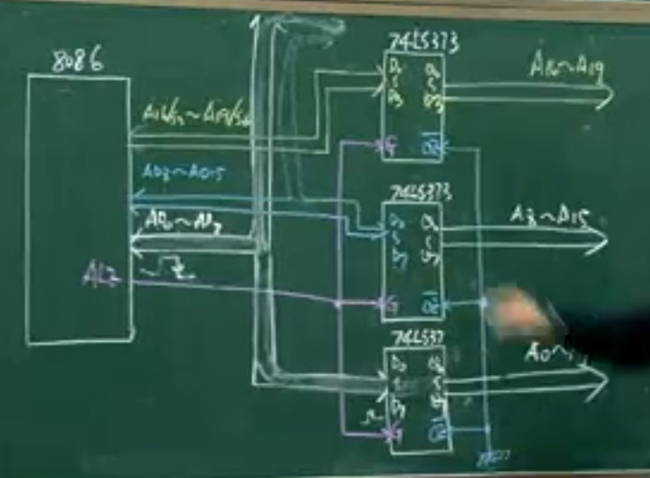

  同理，上面介绍的是地址线，数据总线与其他控制信号结合（元件级总线、微处理器级总线），使用74LS245，就能产生**数据系统级总线**。

  还有S3~S6。

  - S6没用

  - S5，状态寄存器的状态位IF置1，S5==1。

  - S4和S3反应CPU目前操作使用的是哪个段寄存器。

    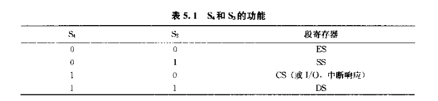

- DT/(R fei)：数据传输方向控制信号，CPU向外输出高电平，向内输入低电平。

  它的时序：比如开始执行`mov [BX],AX`，向外输出，所以T1~T4高电平，之后高或低取决于下一条指令。

- DEN fei：数据有效信号，数据传送进出CPU时，该信号低电平。

- M/(IO fei)：高电平为操作存储器，低电平选择IO

- WR fei：数据信号有效后，产生低电平写信号，并在数据信号有效结束之前，完成写操作。

  存储器读是 RD fei

下面画8086数据总线的形成电路：

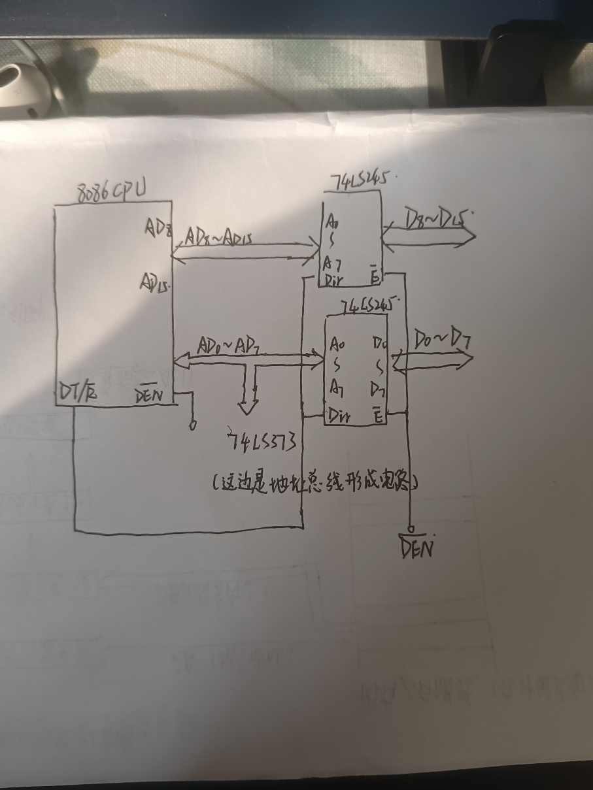

- READY：输入引脚，上升沿采集，下降沿测试，如果READY为低电平，则CPU就得知设备没有准备好，在正常总线周期的第四个T内进入TW等待周期。实现慢速设备和快速设备之间的同步

  READY的下降沿要和CPU时钟的下降沿同步，设计比较复杂，这个过程会在8284内做，做到同步输出。

  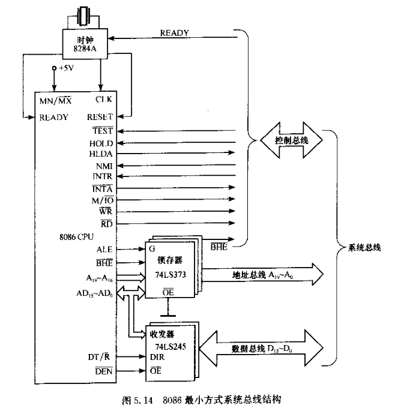

- TEST fei：测试信号，低电平有效。CPU执行WAIT指令，每隔5个周期对TEST端进行测试，若高电平继续等待，低电平进入下一条指令。也能达到快慢设备的同步。

- BHEfei/S7：高字节允许信号。低电平有效。低电平表示使用高8位数据线，高电平低8位数据线。

  类似于ALE，注意在上图5.14中，ALE、BHE也锁存在74LS373，下图看看：

  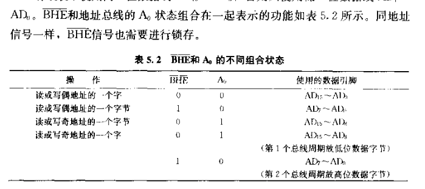

  > 补充：8086和8088的区别：
  >
  > - 内部，指令队列寄存器8086 6字节，8088 4字节
  > - 外部，8086 20根地址线，8088 16根地址线，最小方式下且8086 M/IOfei，8088 IO/Mfei

- INTAfei（出，CPU回答是否响应可屏蔽中断的信号，会连回两次，第一次回复可响应中断，第二次问内容，此后数据线低八位拿数据），INTR（入）和NMI，不提了。

- HOLD（输入），其他总线主控设备申请信号，高电平有效。

  HLDA（输出），CPU对总线使用权的应答，如果让出总线，就高电平，此时CPU的三态引脚全部高阻态，与外界隔离。

控制总线的形成。还是参照上图5.14，相当于直接引出。

### 3.2 最大方式

最大方式的总线结构如下图所示，与最小方式引脚功能有一点不一样，但方法基本一样：

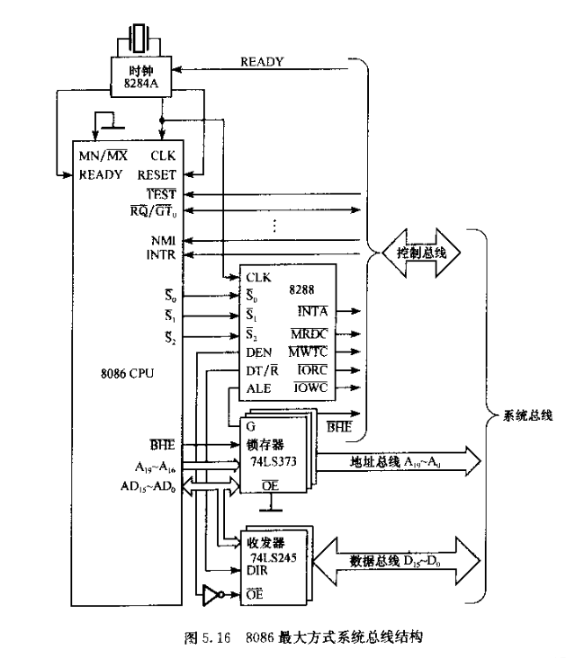

引脚功能区分有：

- S2 S1 S0，

  - 最小模式下，CPU对外部存储器、IO的读写等控制信号**由CPU直接产生**。适合构成单处理器系统。

  - 最大模式下，不由CPU直接产生，而由8086CPU外部的总线控制器芯片8288产生。CPU通过26、27、28引脚来控制8288，8288来**译码并产生**相应控制信号。适合构成多处理器系统。

  - 这里最大方式的26、27、28就是S2 S1 S0。

    > 见本文3.1之前一段。

- 24、25脚：QS1 QS2，表明CPU取指令时的状态。

  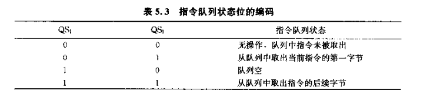

- 30、31脚：RQfei/GT1fei，RGfei/GT0fei，等效于HLDA和HOLD。

  当处理器以外的总线主控设备通过这两个引脚其中之一向CPU申请总线使用权，CPU回复让出，当主控设备停止使用让出总线时，再告知CPU自己让出了总线。

  > 31脚的申请优先级高于30脚。

- 29脚：LOCKfei，如果某条指令，用户认为非常重要，不允许其他总线主控设备向CPU申请总线，就在该指令前方加一个**<总线封锁前缀指令LOCK>**，此时该29引脚就是低电平，通知总线主控设备总线已经封锁。

### 3.3 关于系统级总线

注意！之后的存储器扩展设计和IO扩展设计，都是**基于这一章的系统级总线**进行的。也就是直接展示的三大总线，具体分为高八位第八位、最高四位、控制引脚线等。

> 8086最小方式和8088最大方式都是重点

- 8086最小方式：

  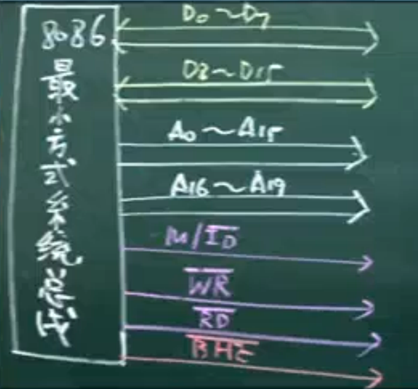

- 8086最大方式：

  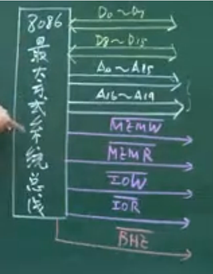

  都可以再加上RESET和INTR等。

- 8088最小方式：没有BHEfei，数据总线8位

  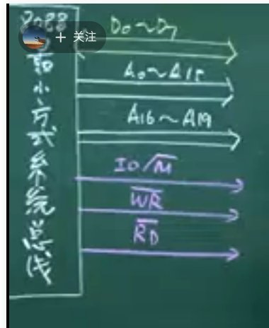

- 8088最大方式：

  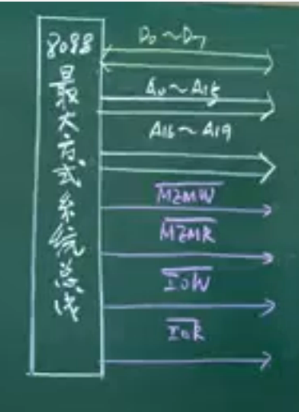

### 3.4 IBM--PC/XT系统

下面老师讲解了IBM--PC/XT系统，使用8088CPU且为多处理器系统（也就是最大模式）。

> 这个我们老师没有讲，而且年代久远现在可能也不考了。我只是对PC/XT这个总线感兴趣，可能对以后深入学习PCI有帮助。
>
> 不过讲道理，这里的总线，偏向于电路设计，而我想象的总线是软件协议。
>
> 这部分先不着急，先考试。

P178，课本。

**此外我搜索了一个总线提纲：[01 微型计算机总线 - 最全的接口技术提纲](https://www.cnblogs.com/rsmx/p/13764961.html)**

PC／XT总线是将8088  CPU的引脚经过8282锁存器、8286发送接收器、8288总线控制器、8259中断控制器、8237DMA控制器以及其他逻辑电路的重新驱动和组合控制而形成的。

**总线信号线**共62条

- 8条双向数据线D7~D0 ；
- 20条单向地址线A19~A0 ；
- 控制线：
  - 6条中断请求线；
  - 3对DMA申请线和4条DACK线；
  - 4条 存储器和I/O设备的读写命令线；
  - 1条系统时钟信号线、1条I/O奇偶检测线、1条I/O就绪线及其他联络信号线。
- 4种电源（±5V、±12V）共8条线

