# 微机原理与系统设计笔记6 | 存储器系统设计

------

- 打算整理汇编语言与接口微机这方面的学习记录。本部分介绍存储器及其扩展方法。

- 参考资料
  - 西电《微机原理与系统设计》周佳社
  - 西交《微机原理与接口技术》
  - 课本《汇编语言与接口技术》王让定
  - 小甲鱼《汇编语言》

------

## 1. 存储器的分类

- 外存：磁盘、U盘、光盘等，外存严格来说属于IO设备。

  > 顺序存储器和随机存储器：读写数据的方式不同。

- 内存：本文主要讲内存。

  - 只读存储器：存放系统管理程序，比如计算机主板ROM里的BIOS程序。

    - ROM：一次性写，只读。

    - PROM：一次性可编程、只读；

      > 每个新的芯片为空片：如果以字节为单位，则为FFH。

    - EPROM：常用，紫外线可擦除ROM，借助专用写入器可以将程序写入（写入的时候要先擦干净）。

      > 目前常用型号：2716（2K乘8字节==2KB），2732，2764，27128。
      >
      > 后两者目前常用。

    - E<sup>2</sup>PROM：电可擦除ROM。可以反复写入，先擦除干净后写，且掉电后信息不丢失

      > 常用是28系列。

  - 随机读写存储器RAM：能读能写，但是掉电后信息丢失。

    - SRAM：静态，像寄存器/锁存器。

      > 常用型号6264（8k×8bit==8KB）、62128、62256、2114（1K乘半字节，需要用两个2114并成一个字节--位扩展）

    - DRAM：动态，像电容，存1相当于给电容充电，所以需要反复给DRAM上电刷新（读出来再写入，刷新周期要满足一定条件，太长就不能让系统辨认原有数据了）。

      应用DRAM需要设计地址刷新电路，而这个刷新电路很复杂，所以自己设计系统一般使用SRAM。

      DRAM集成度更高（虽然较于SRAM速度慢一点点），而计算机使用的都是DRAM。

      本章主要是内存中ROM和SRAM的设计。

- 从结构角度的分类/微机系统中存储器的层次结构：

  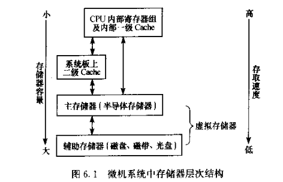

## 2. 存储器主要技术指标

1. 容量

   如果要设计32KB，62256（32K乘8bit==32KB）需要1片，2114需要64片

   这里尽量选择接近的芯片来做，比如2114的话占用面积大且对电源要求高。

2. 速度

   - 存取时间：启动一次存储器操作到完成此次操作的时间

   - 存储周期：两次独立的存储器单元操作的**最小时间间隔**

     > 可以从半导体公司手册查到。

   - 要求：（针对8086读写周期需要4个clk周期这一点）

     下面的公式应该不会考，了解吧：

     - 存储器芯片的最小读出时间：$t_{cyc}(R)<4T-t_{da}-t_D-T$

       > - T：8086时钟周期
       > - tda：8086的地址总线延时时间
       > - tD：各种因素引起的总线附加延时。总线长度、附加逻辑电路、总线驱动器等之和、
       >
       > 减去一个T是因为工程上的要求。

     - 存储器芯片的最小写入时间：$t_{cyc}(W)<4T-t_{da}-t_D-T$

3. 存储带宽：单位时间传输数据容量的大小。

   带宽（B，MB/s）==存储器时钟频率（F，MHZ）*存储器数据总线位数（D）/8

   $B=F\times D/8$

4. 非易失性：是选择ROM还是RAM。

5. 可靠性：平均故障时间间隔。

6. 功耗、成本等


## 3. 几种常用存储器芯片介绍

### 3.1 SRAM 6264

8K×8bit，有13根地址线（编码8k），数据引脚8根（引脚8bit），此外还需要片选信号。

6264有两个片选信号CS1fei和CS2：

- CS2高电平，CS1fei低电平则为选中。根据13根地址线选中的单元进行写或读操作
- 未选中则8根数据线呈现高阻态，与系统总线隔离。
- 也可以将CS1常接+5V来改造为单片选。

还有一个输出允许脚OEfei，片选有效且输出允许有效时，可以输出数据。一个写允许脚WEfei，与片选结合可以写入数据。

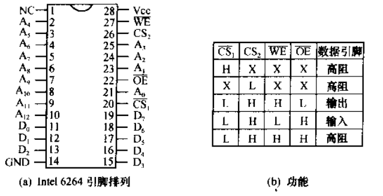

> 注意不能同时写或读。OE和WE只能一个有效。

与8088CPU的地址总线结合起来来看，则8086的低13位地址线A12~A0直接寻址6264内部，这叫片内寻址；而高位地址线A19~A13，片外寻址，也就是决定是1MB的哪一个8KB，引出译码作为控制信号，作为片选信号。这一点比较好理解。

> 注意这里8088没有奇偶地址的概念，比较简单。

8086CPU的地址总线。则A1~A13来片内寻址，A0决定是奇还是偶地址，高位A14~A19片外寻址。

- 如果A0=0，则取出A13~A0的16KB字节的8K**偶**字节，与系统数据总线的**低8位**相连。
- A0=1，则取出A13~A0的16KB字节的8K**奇**字节，与系统数据总线的**高8位**相连。

而如果用6264给8088微机系统设计32KB的SRAM：

- 需要4片
- 地址线对联8088地址线，数据线也对联。
- 使CS2常有效
- OEfei，读允许。在最大方式下，与MEMRfei相连；最小方式下，与RDfei相连。
- WEfei，写允许。最大方式下，与MEMWfei相连。最小方式下，与WRfei相连。
- CS1fei片选信号。地址线的高位（接入译码电路产生控制信号，再接过来片选。

> 上述思路是字节扩展，P198 6.4.2
>
> 注意**译码电路不仅是地址，还有控制信号。**比如8088最小方式中有IO/Mfei，表示对存储器操作。
>
> 这里实际只需要两位A13和A14来选择芯片块，同时也可以再加上其他不变的高位地址线，参与译码

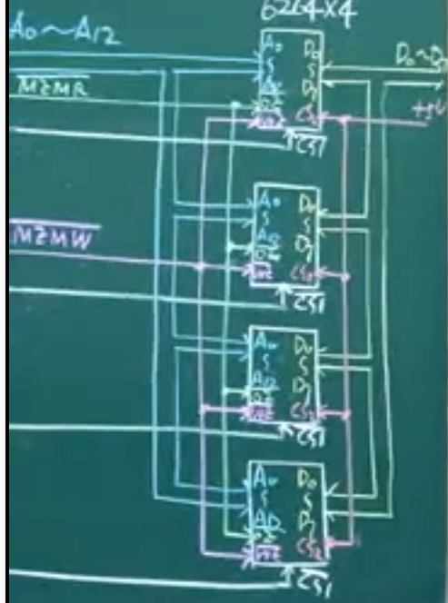


### 3.2 SRAM：Intel 2114

1K×4bit。有10根地址线，4位数据线。

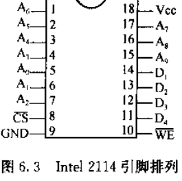

- CSfei，低电平选中
- WEfei，管理读写，低电平写入存储器，高电平输出。


使用2114给8088系统扩充4KB存储系统：

- 需要8片

- 先两两相并位扩展，再串联字节扩展。

  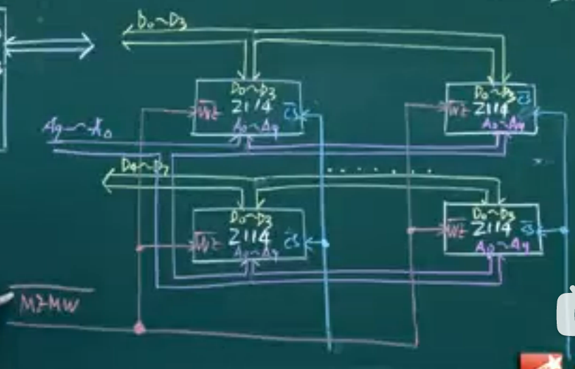


### 3.4 EPROM 2764

8K×8，所以13根地址线，8根数据线

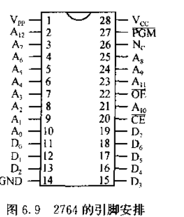

- CEfei：片选信号
- OEfei：片选有效且低电平，读出数据（也就是只读状态）
- VCC：工作电压
- VPP：编程电压输入，需要查公司型号手册
- PGMfei：低电平（负脉冲），编程允许引脚

要对2764先擦除后写入数据：

1. 擦除。

2. OEfei无效，CEfei有效。

3. 不是直接接到地址线和数据线，两边各需要一个锁存。将地址和数据都锁存起来

4. 当上层命令来到，VPP电压加上，PGM加负脉冲，在这个负脉冲期间，锁存也解除，向选中地址写入相应数据

5. CE OE有效，将写入的数据读出（无锁存器的通道），比较是否符合预期，如果符合，则写入完成。

   如果不相等，可重新操作，如果多次操作不行，可能地址单元损坏。

> hhh，学了这个可以做编程器了...

2764的正常工作/只读模式：

- 只需要考虑地址（奇偶等等）、数据（单向输出）、CE片选信号、OE连接MEMRfei，不考虑VPP和PGM（接+5V即可）

## 4. 存储器扩展设计

### 4.1 存储器地址译码方法

- 全地址译码方法：全部地址线来译码，浪费硬件设计资源（因为地址线都要引过来），但是可以唯一确定一个存储单元的地址。
- 部分地址译码方法：译码电路简单，但会发生地址空间重叠。

例题见书P200 6.1

### 4.2 8088系统存储器扩展

P205 例6.5

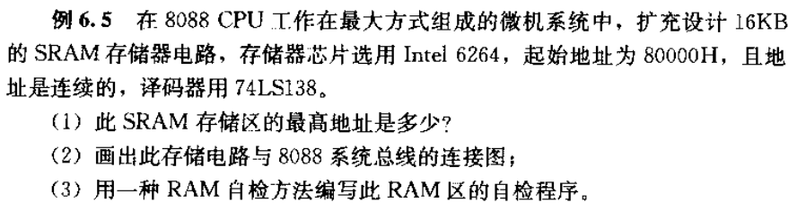

- 第一题，简单，16KB为2的14次方，16进制是4000H，地址范围就是80000H~83FFFH

- 第二题：

  1. 进行地址分析：

     - 需要两片6264
     - 低13位片内选址，A13选择两片之一
     - A19~A14六根线，在此题不变，且为10_0000
     - 这样就保证了连续地址。

  2. 逻辑电路（不用型号）：

     - 需要加入控制信号，表明是对存储器操作。

     整体设计如下图所示：

  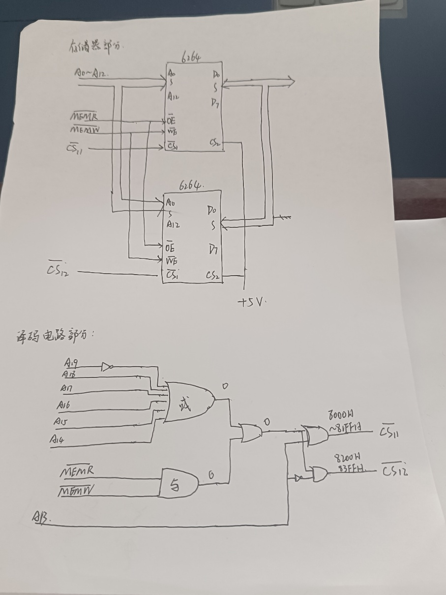

  如果使用74LS138来做译码器（这个我没有学，跟上图原理相同，只不过封装了一些东西）

- 第三题：用到一点点汇编知识。这里55H和AAH数据图案检测，给要检测的RAM存储区每个地址单元分别写入55H(0101_0101)和AAH(1010_1010)，并读出比较是否符合预期，如果符合，则读写正常。如果不正常，则应作出相应出错报警提示。

  ```assembly
  MOV AX,8000H
  MOV DS,AX
  MOV SI,0
  MOV CX,16*1024
  MOV AL,55H
  NEXT1: MOV [SI], AL
  	   MOV BL, [SI]
  	   CMP BL, AL
  	   JNE ERROR ;不相等则转到ERROR
  	   INC SI ;地址增加继续比较
  	   LOOP NEXT1
  	   MOV SI,0
  	   MOV CX,16*1024
  	   MOV AL, 0AAH
  NEXT2: MOV [SI],AL
  	   MOV BL,[SI]
  	   CMP BL,AL
  	   JNE ERROR
  	   INC SI
  	   LOOP NEXT2
  	   ...
  ERROR: ...
  ```

  - 数据线粘连故障：检测思路就是55H和AAH
  - 地址线链桥故障：先把存储器刷成00H，然后向00H处写入01H，检测其他地址单元是否改变，00H地址单元左移为02H，看其他地址单元内容是否改变......这样就可以找出地址线粘连发生的不同地址内容的重写问题。
  - BIOS中自检就是排除这些故障，程序会更加丰富。

### 4.3 8086系统存储器扩展

扩展原理基本相同，相较于8088，多的是奇偶地址的片选：

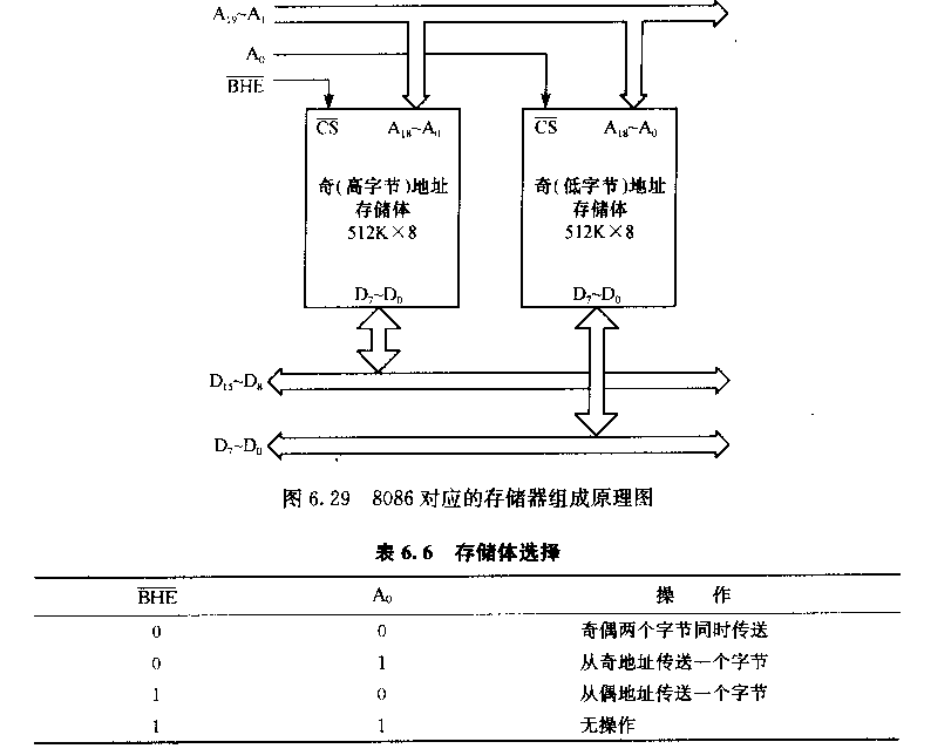

- 上图没有体现出来的是，A0和BHEfei还要跟相应控制信号一起进行逻辑运算才行，比如最大方式下MEMRfei、MEMWfei和M/IOfei，最小方式下RDfei、WRfei和M/IOfei
- 此外512k的芯片上还应有CE和OE，分别是
  - CEfei：片选信号，
  - OEfei：读允许
  - WEfei：写允许


P208 例6.6：

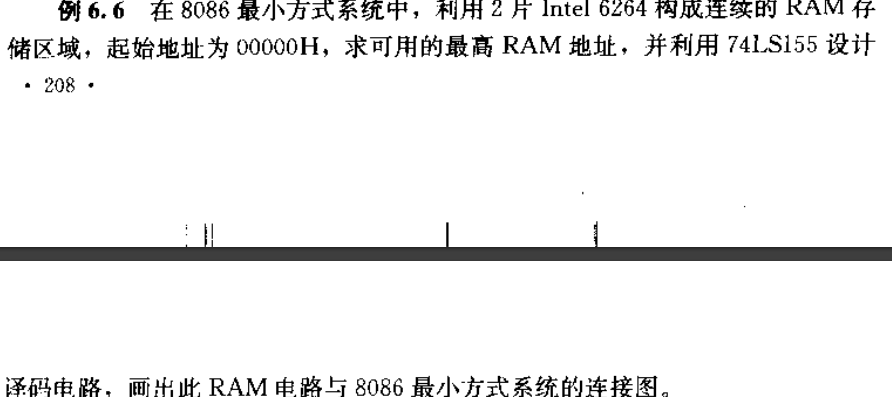

- 上图改为74LS138，但这个器件我不总结了，我没学。

- 设计图如下图所示：

- 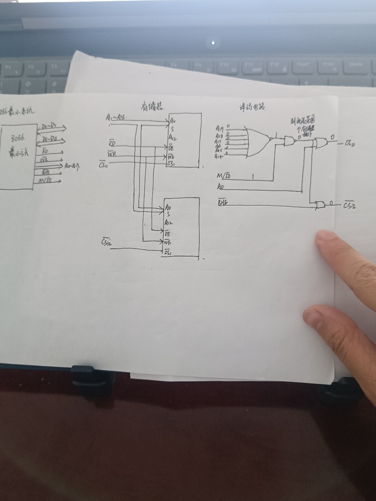

  
