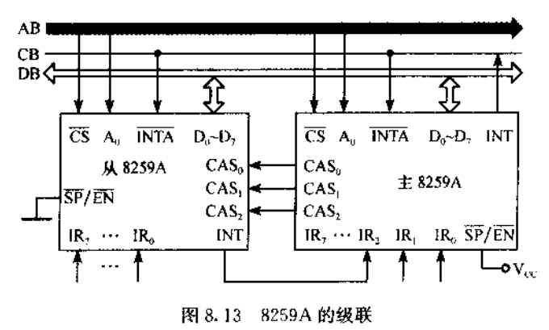

# 微机原理与系统设计笔记7 |常用芯片接口技术、中断系统与可编程中断控制器8259A

------

- 打算整理汇编语言与接口微机这方面的学习记录。本部分介绍常用芯片接口技术、中断系统与可编程中断控制器8259A。

- 参考资料
  - 西电《微机原理与系统设计》周佳社
  - 西交《微机原理与接口技术》
  - 课本《汇编语言与接口技术》王让定
  - 小甲鱼《汇编语言》

------

# Part1 常用芯片的接口技术

## 1. I/O接口的概念

由于设备种类繁多，通信的信息格式多样，所以CPU与设备之间不能直接通信，必须在两者之间设计一个电路将两者连接，这就是I/O接口电路。

- 接口电路是I/O硬件
- CPU和外设的通信协议就是I/O软件，本课程使用汇编语言实现（工程中大多数已经用C语言开发）

硬件、软件两者合起来，就是I/O接口技术。

## 2. I/O接口的基本组成

I/O接口电路介于系统总线和I/O设备之间。课本图示如下：


老师的图示如下：


- **一种信息要通过一个IO端口来传送**

  这个端口本质是一个缓冲器/锁存器/寄存器，用来存放一些信息。

  - 状态信息（入）

    以一个输出设备为例，CPU采集I/O设备的状态，如果可以响应CPU，则放入数据给设备

  - 数据信息（入/出）

    数据线将数据放到数据端口，

  - 命令信息（出）

    通过命令信息，让设备知道数据信息已经来到。比如一个负脉冲，告知设备数据有效，设备在该负脉冲器件就可将数据端口的数据取出。

    > 出--CPU、入--CPU

- **一个I/O端口要分配一个I/O地址，叫I/O端口地址、端口地址。**

  同时上图还有片选信号CS，用于选中这个IO端口，也要针对它们设计**I/O地址译码电路**。


## 3. I/O地址的编址方式

此前提到过：

- 独立编址（80x86）：

  8086CPU中表现为低16位地址线编址I/O，通过M/IOfei来区别是对存储器操作还是对I/O操作。

  > 8088中是IO/Mfei

  这样I/O地址不占用存储器地址空间。但是缺点是指令系统不能通用地操作存储器和I/O了，这样对I/O寻址的方式也不会像存储器那么丰富了（直接寻址和DX寄存器间接寻址），不那么灵活。

- 统一编址（MCS51CPU）：

  比如AT89C51，统一共享64kb的存储空间。


## 3. I/O输入/输出方式

### 3.1 程序直接控制的输入输出方法

**无条件输入输出方式**和**查询法输入输出**以及 **中断法**

- 无条件输入/输出方式

  一些简单设备（比如LED灯）永远处于准备好状态，不需要提前获取状态信息。

  这种情况下，没有状态端口，也没有命令端口，只留数据端口即可。不过像第2节组成部分里讲的一样，还是需要锁存信息。（锁存常用74LS374和74LS273）

  > 这里老师讲了74LS373，emm，涉及总线那一部分的时序问题，总之不选

  

- 查询法输入输出

  

  - 测设备状态：

    ```assembly
    MOV DX,PORT_NUM
    L1:	
    	IN AL,DX ;设备状态读入AL
    	TEST AL, 01H
    	; 假如状态是低电平有效
    	JNZ L1 ;没准备好继续查询
    ```

  - 电路实现比较简单，缺点是效率比较低，1是如果设备一直没准备好，需要反复询问，如果设备比较多，轮询的过程中可能错过某个设备准备好的时机。

  - 如果CPU不忙，设备较少，可以使用这种方法。

- **中断法：重点**

  CPU查询效率太低，不如让设备准备好后向中断控制器8259提出请求，8259再向CPU提出请求。

  当CPU开中断（允许中断），CPU就会保护当前程序的现场（几个重要寄存器），进而执行中断对应的中断服务程序，执行完毕后IRET返回。返回后恢复现场。

三种方法可以统称为：程序直接控制的输入输出方法（因为都是用IN、OUT指令）

### 3.2 DMA法

> 重点并且此前计组和计操对这点掌握都不深刻。

3.1的中断法虽然很好了，但是：

- 输入输出指令花费的周期很长
- 完成的CPU与外设之间的数据输入输出也很花费时间
- 每完成一次中断，都花费很大的中断开销（中断服务程序）
- 流水线CPU中，中断完成返回断点处指令时，还会引起流水线断流，降低效率。

而DMA方法完全由硬件（DMAC，DMA控制器，8237）完成，不受程序控制，速度很快。

> DMA虽然不考，但好歹继续了解一下。


一个输入设备的完整DMA传送过程：

1. DMAC的设置：微处理器启动输入设备，将并将数据块在内存的起始地址、数据块的字或字节数、DMA的工作方式等内容写入DMAC的地址寄存器、字计数器和控制/状态寄存器。
2. 输入设备将数据写入DMAC的数据缓冲器，向DMAC提出DMA请求
3. DMAC向CPU发出HOLD信号，申请总线使用权，CPU释放总线，通过HLDA对DMAC应答。
4. DMAC占用总线，通过总线给出地址、数据、写信号，将数据写入内存，字计数器-1，向输入设备作出DMA应答
5. 重复操作，直到计数器==0，释放总线告知CPU。


此后讲解的是3.1受程序控制的的例程，并且不包含中断法，中断法的例程在Part2单独一章。

## 4. 常用芯片的接口技术

### 4.1 一个小总结

#### A. 接口芯片

前面已经用到了很多接口芯片，在[笔记5](https://www.cnblogs.com/Roboduster/p/17135608.html)中已经介绍了74LS244、74LS245（数据双向缓冲）、74LS373、74LS374 / 74LS273。

上面还提到了**尽量选374而不是373**，因为前者是上升沿有效，后者高电平有效，由于微处理器的时序关系，可以知道前者更好一点。

#### B. I/O用到的系统总线信号

以及，不同的系统进行I/O端口地址译码以及I/O电路设计时，总线信号：

- 
- 值得注意的是IBM PC/XT系统，对IO编址只用了A9~A0，共编址1KB，前为主机板上的I/O，后512B分配给插件板上的I/O。
- 当AEN=1时，表示正进行DMA操作，所以设计译码电路时，应使AEN=0。

#### C. 系统总线驱动及控制

可以通过缓冲器/总线驱动器来提高总线负载能力，比如74LS373 74LS244（单向8位） 74LS245（双向8位），双向系统数据总线驱动需要：

- CPU读I/O时，驱动器面向系统总线的一侧导通
- CPU写I/O时，驱动器面向I/O的一侧导通
- CPU不寻址I/O端口，则驱动器两侧均高阻态。

### 4.2 无条件输入输出

这里老师讲了书上231页例题7.1（无条件输出）、7.2（无条件输入），讲的很不错

> 2023-02-22，又听了一遍，跟后续查询法和中断法的设备难度差距很大，不做记录了。

### 4.3 查询法

> 2022-02-21，P93和P94回头再看吧，要考试了5555.
>
> 2022-02-22，昨天太焦虑了，又听了一遍，感觉还好

讲了一个查询法A/D转换器的例子，书上没有。


# Part2 中断系统与可编程中断控制器8259A

中断系统主要是8086系统，而8259A管理的是INTR引脚的可屏蔽中断。

## 1. 中断相关概念

已经讲过一次，是在[笔记4的第五部分](https://www.cnblogs.com/Roboduster/p/17126073.html#5-%E4%B8%AD%E6%96%AD%E8%B0%83%E7%94%A8%E4%B8%8E%E8%BF%94%E5%9B%9E)。

- 中断：CPU执行程序的过程中，由于某个时间的发生，CPU暂停当前程序，转去执行处理该事件的一个中断服务程序，待中断服务程序执行完后，返回被中断的程序继续执行。

- 中断源：内部中断源、外部中断源

- 中断类型号：为每个中断源编号，8位2进制编码，所以可以管理256个中断（最多），进而执行相应服务。

  其中，内部中断源和外部不可屏蔽中断都有固定中断号，而INTR可屏蔽中断没有固定的中断号，要加一个中断控制器8259A，CPU要将相应中断号初始化到8259A上（OUT指令），中断响应期间，CPU就会从外部8259上取中断类型号。

  > 所以外部可屏蔽中断号是可自己设置的。同时还可以设置这些外部可屏蔽中断的优先级（初始化时）

- 中断向量：32位，中断服务子程序的入口地址，段地址:偏移地址。

- 中断向量表：8086中将存储器1M最低的1024个单元作为中断向量表，依次有序存放中断向量（一个向量4个字节，前两字节偏移地址，后两字节段地址）。

- 中断过程：

  如果是外部可屏蔽中断，需要IF=1才能响应

  1. 中断发生时，先将当前指令执行完。

  2. 保护现场再保护PSW CS IP等寄存器，依次压栈保护。

  3. 如果是外部中断，从8259A获取中断号

  4. 清除IF和TF=0，也就是拒绝外部可屏蔽中断请求。
  
     > 如果允许中断嵌套，那在中断服务开始时，用指令`STI`开中断
     
  5. 执行中断服务子程序，执行完毕后IRET返回主程序，恢复现场继续执行原程序。

## 2. 可编程中断控制器8259A

### 2.1 8259A的引脚功能及其级联工作

首先是8259A的外部引脚，及其功能：


- IR0~IR7：八个引脚，输入，用于外设向8259A发送中断请求信号

- CSfei：片选，片外寻址

- A0：片内寻址，用于寻址8259A内部的端口。

  > 只有两个地址，但8259A不止两个端口，需要D0~D7中某些位为特征位来识别。

- D0~D7：数据线。CS片选无效，则高阻态；CS片选有效，则两态，可供读写。

- WRfei、RDfei：写控制端、读控制端

- INT：高电平有效，当中断来临，且未被屏蔽，通过INT向8086CPU的INTR引脚发送中断请求。

  如果CPU开中断，则通过INTAfei发送两个负脉冲（接收端是8259A的INTA引脚），第一个脉冲告知8259A其请求CPU可响应，第二个脉冲期间，8259A将此次中断源的中断类型号发到D0~D7，CPU读取中断类型号（8086的低八位数据线）。

- SPfei/ENfei：主从设备设定/缓冲器读写控制，双向双功能。

  缓冲方式是：D0~D7和CPU之间可再加一双向缓冲器，ENfei作为**输出端**控制该缓冲器的使能端（很少用）。

  非缓冲方式：D0~D7直连CPU，该引脚作为**输入**，此时说明8259A是单片工作或是级联工作中的主片（是直接与CPU相连的8259A）

  > 主片：SPfei接+5V
  >
  > 从片：SPfei接GND

- CAS2~CAS0：三根双向级联线，主片上该引脚为输出，从片为输入。

  当从片收到中断请求，从片发送给主片，主片向CPU发送，CPU若响应，则第一个负脉冲主从两片都收到，第二个负脉冲，也是主从两片都能收到，此时主片查看是哪个引脚到来的中断（假设从片接在IR1上，那就是IR1的中断），并从CS2~CS0端口向从片发送编码001，表明是IR1的请求。后续级联的从片根据该001编码，检测主片是在呼叫哪一片从片，如果是自己，则将自己的中断找到对应的中断类型号，通过D0~D7送到数据线上。

  直接说可能太抽象了，看看图吧：

  


### 2.2 8259A的内部组成


- IRR 中断请求寄存器：8位，寄存外部中断请求信号，请求来到，则对应位置为1。能否寄存受IMR寄存器的控制。

- IMR 中断屏蔽寄存器：8位，屏蔽对应位置的中断输入，比如0000_0001，屏蔽的是IR1的中断。

- 优先权分析器：把IRR8位中所有的1分析一下，找出最高优先级的中断，将其交给ISR寄存器，使其对应位置1。置为1说明8259A已经开始服务该中断。

- 接下来就是INT向CPU发送请求，CPU可响应的话向INTAfei发送两负脉冲，取出中断类型号。

- 中断结束方式：结束方式，8259A可以初始化为两种方式

  - 中断自动结束，收到第二个负脉冲，8259A一方面发送中断类型号，另一方面将ISR对应位清0，中断服务结束。

    > 一般不用。

  - 非自动结束：发送中断类型号后并不清0，CPU执行完中断服务子程序，在IRET之前，向8259A发送OUT 中断结束指令，8259A收到后结束中断。

- 内部控制逻辑电路：

  1. 4个ICW寄存器ICW1~ICW4：初始化命令寄存器，设置8259A的各种工作属性
     - ICW1：级联还是单片，还有IR0~IR7的信号是高电平有效还是上升沿有效
     - ICW2：中断类型号基址，也就是IR0对应的中断类型号，其他是连续的。
     - ICW3：级联时使用，告知主片哪一个IR连接从片（对应位置为1），告知从片自己级联在主片的哪一个IR上。
     - ICW4：初始化8259A是缓冲式还是非缓冲式，优先级是固定优先级（IR0>...>IR7）还是循环优先权（最初IR0最高，响应IR0后IR1置为最高...）
  2. 3个OCW寄存器OCW1~OCW3：操作命令字，在初始化后任何时刻进行，改变8259A的工作方式。
     - 向OCW1写命令，相当于向IMR写，用于屏蔽/解除屏蔽中断
     - OCW2：改变中断结束方式
     - OCW3：改变中断屏蔽方式。正常非自动结束方式用不到。

> 到现在已经有了7个端口，而只有一个A0用于片内寻址，还需要通过D0~D7的特征位进行区分。

最后还有几点：

- 主片分配的IO地址是20H和21H，保证A0的0和1。从片分配的IO地址是A0H和A1H。
- BIOS加电自检初始化时，主片上的中断类型号基址初始化是08H，从片是70H。
- 优先级方式如果是默认的也就是固定优先级，当从片接在主片的IR2上，那么，优先级顺序就是 IR0>IR1>IR8>IR9>...>IR3>...>IR7。


### 2.3 8259A的工作方式

基本已经讲的差不多了。8259A一次完整的中断响应过程如下：

> 跟上面的讲解多少有点出入，以此为准）

1. 中断源在IR0~IR7上产生中断请求

2. 中断请求锁存在IRR（经过IMR屏蔽），结果送给优先权分析器。

3. 控制逻辑电路接收中断请求，向微处理器发送INT信号

4. CPU从INTR接收8259A的INT信号，发送连续两个INTA负脉冲

5. 优先权分析后根据最高优先级中断置位ISR。

6. 若8259A是主片（中断源不直接连在其上时），第一个INTA负脉冲将级联地址从CAS2~CAS0发出。

   若8259A是单独使用或是由CAS0~CAS2选择的从片，则在第二个负脉冲将中断类型号发送到低八位数据总线。

7. 8086CPU读取中断类型号，转移到对应的中断处理程序。

8. （非自动结束方式），中断服务子程序结束前，向8259A发送EOI（中断结束）命令，ISR复位，中断结束。


### 2.4 8259A的编程

#### A. ICW

首先是对ICW的4个寄存器写

1. 初始化ICW1：

   - A0=0，D7~D5没用，D4=1作为标志位
   - D3=0，上升沿有效（=1则高电平有效，一般使用上升沿）
   - D2，8086中无用
   - D1：0是级联，需要初始化ICW3，1是单片。
   - D0：置为1，要初始化ICW4

   举例：

   ```assembly
   MOV AL,11H
   OUT 20H,AL;写到主片，编码为00010001
   ; 从片
   ; MOV AL,11H
   ; OUT 0A0H,AL
   ```

2. 初始化ICW2：

   - A0=1
   - D7~D3是中断类型码的高五位（基本无效），D0~D2放类型号基址。

   ```assembly
   MOV AL,08H
   OUT 21H,AL
   ;从片
   ;MOV AL,70H
   ;OUT 0A1H,AL
   ```

3. 初始化ICW3：级联必须初始化，单片不需要

   - A0=1
   - 主片的某位置1，说明该位对应的IR被从片级联
   - 从片的ICW3高五位没用，低三位编码自己连接在哪个IR。比如010表示级联在IR2上。

   ```assembly
   ;主片
   MOV AL, 04H
   OUT 21H, AL
   ;从片
   MOV AL,02H
   OUT 0A1H,AL
   ```

4. ICW4的初始化：

   - A0=1，D7~D5=0是特征位
   - D4=0，表示固定优先级，D4=1是特殊优先级
   - D3：缓冲1还是非缓冲0（一般是非缓冲）
   - D2：从片还是主片，在无缓冲的情况下没有意义（也就是D3=0时）
   - D1=0为非自动结束（也就是需要EOI），D1=0为自动结束
   - D0=1，表示使用的是8086/8088系统，若为0说明是8080/8085系统

   ```assembly
   ; 主片
   MOV AL, 01H
   OUT 21H, AL
   ; 从片
   MOV AL, 01H
   OUT 0A1H, AL
   ```

#### B. OCW

接着是OCW操作字。

1. 操作OCW1：

   - A0=1（初始化后，再向A0=1处写，则操作OCW1）
   - 某位写1，对应IR被屏蔽。只有未屏蔽的IR，8259A才能响应。
   - 读OCW1：可以读出IMR的值，进而确定屏蔽中断。

2. OCW2：

   - A0=0
   - D5为EOI位，置1则通知8259A结束中断，ISR清0。
   - 其他位不重要，设置其他中断方式、优先级方式，可自查。

   ```assembly
   MOV AL,20H
   MOV 20H,AL
   ```

3. OCW3：

   改变屏蔽方式，可自查。

## 3. 8259A的应用

讲了个例题，书上P262例8.4，挺好玩。


```assembly
STACK SEGMENT STACK
	DB 256 DUP(?)
STACK ENDS

DATA SEGMENT
	; 读入的数据放置的地方
	IN_BUFFER DB 100 DUP(?)
	; 
	IN_POINER DW ?
	; 读出IMR放在INT_IMR，查看并备份屏蔽情况
	INT_IMR DB ?
DATA ENDS

;书上使用DOS功能调用的方法创建向量表
CODEM SEGMENT
	ASSUME CS:CODEM,DS:DATA,SS:STACK
START:
	;DOS功能调用方法建立中断向量
	MOV AX, IN_INTR; 中断服务程序入口，自己设置的，在最下面
	MOV DS, AX ;段地址给DS
	LEA BX, IN_INTR ;偏移地址给BX
	; 功能号250H，类型号0BH
	MOV AX 250BH 
	
	INT 21H		; DOS设置中断向量
	
	
	/*
	更通用的思路（原理性），平替上面五行
	mov ax,DATA 
	MOV DS,AX
	
	CLI;关闭中断
	PUSH DS
	MOV AX,0
	MOV DS,AX ;DS此时是中断向量表的首地址
	MOV BX,4*0BH;BX是待建立的中断向量偏移地址
	MOV AX,OFFSET IN_INTR ;IN_INTR是中断服务子程序
	MOV [BX],AX;把中断服务程序偏移地址写入BX位置
	MOV AX,SEGMENT IN_INTR
	MOV [BX+2],AX;把中断服务程序的段地址写入BX+2位置
	POP DS 
	STI ;开中断
	*/
	
	
	
	;装载数据段初值（如果pop完就不需要）
	MOV AX,DATA
	MOV DS, AX
	; 立即数寻址，设置指针初值
	MOV IN_POINTER, OFFSET IN_BUFFER
	IN AL,21H ;读入IMR，默认BIOS已经初始化8259A
	MOV INT_IMR, AL;放入备份位置,暂存原IMR
	AND AL,F7H;OCW1, 1111_0111，屏蔽对应位置
	OUT 21H, AL; 清除IR3屏蔽位
	STI ;开中断

; 显示
MOVE：
	;从键盘读一个字符，不等待，而如果没有输入，就等在这了
	MOV AH,06H
	MOV DL,0FFH
	INT 21H
	CMP AL,0DH ;比较输入是否是回车
	JNZ MOVE ; 如果不是回车，继续回去等待回车引发的中断
	MOV AL,INT_IMR; 结束输入了，恢复屏蔽字
	OUT 21H,AL
	...;结束处理
	MOV AX,4C00H
	INT 21H
	
CODES SEGMENT
	ASSUME CS:CODES
IN_INTR PROC FAR
	PUSH DS
	PUSH AX
	...;一些保护现场
	STI; 设置开放中断，允许响应更高级中断
	MOV BX,IN_POINTER
	/*
	注意，
	上文程序中已经有MOV IN_POINTER, OFFSET IN_BUFFER，此时BX，就是IN_BUFFER的偏移地址，下面[BX]，就相当于 DS:BX
	*/
	MOV DX,240H 	;输入端口的地址，通过DX对IO间接寻址
	IN AL, DX
	MOV [BX],AL ; 数据存放进缓冲区
	INC BX
	MOV IN_POINTER,BX ;移动指针
EXIT:
	CLI ;严谨一点，关中断
	OUT 20H,AL ;向8259A发送eoi，中断结束命令
	...; POP恢复信息
	IRET ;中断服务子程序返回
	
IN_INTR ENDP
CODES ENDS
END START
```

