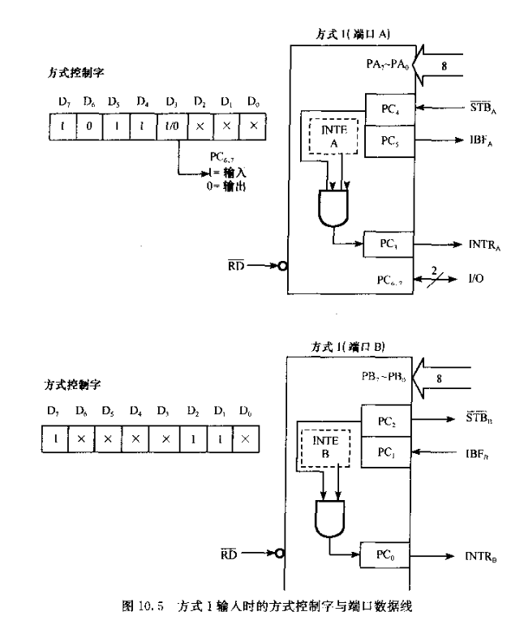
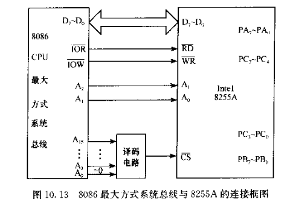
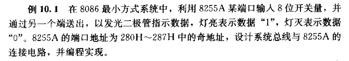

# 微机原理与系统设计笔记8 | 可编程并行接口芯片8255A&&可编程定时器、计时器芯片8253、8254

------

- 打算整理汇编语言与接口微机这方面的学习记录。本部分介绍可编程并行接口芯片8255A&&可编程定时器、计时器芯片8253、8254。

- 参考资料
  - 西电《微机原理与系统设计》周佳社
  - 西交《微机原理与接口技术》
  - 课本《汇编语言与接口技术》王让定
  - 小甲鱼《汇编语言》

------

# Part1 8255A

## 1. 有关并行接口

第一章就已经提过，外设和CPU之间不能直接进行数据交换，要增加接口电路，并行接口就是数据在多根线上同时传送。并行接口的特点：

- 具有端口寄存器
- 与CPU和外设进行联络的控制端
- 中断控制端
- 可编程器件提供多种工作方式供编程选择。


常用的并行接口芯片是Intel 8255A。串行接口芯片是8250和8251。

## 2. 8255A的结构及其功能


- PA0~PA7：端口A，连接外设

- PC0~PC7：端口C，连接外设

- PB0~PB7：端口B，连接外设

  > 这几个端口输入还是输出是可编程的。

- D0~D7：数据总线（双向），连接CPU

- VCC、GND、CSfei、RDfei、WRfei耳熟能详了

- 工作方式控制寄存器，可以OUT数据线写，控制芯片工作方式

- A0、A1：端口地址线，连接CPU

  > 有四个端口，A B C端口+ 工作方式控制寄存器

  | CSfei |  A0  |  A1  |      端口      |
  | :---: | :--: | :--: | :------------: |
  |   0   |  0   |  0   |       PA       |
  |   0   |  0   |  1   |       PB       |
  |   0   |  1   |  0   |       PC       |
  |   0   |  1   |  1   | 内部控制寄存器 |
  |   1   |  /   |  /   |       /        |

  因此也可以看出8086系统中，8255A的A1接地址线A2，A0接A1，高12位参加译码。

  如果地址是偶地址，地址线A0也参加译码，D0~D7连接低八位数据线。奇地址则BHEfei参加译码，D0~D7连接高8位数据线。

- RESET，复位端，高电平有效

  > 设备复位应当早于CPU复位。

## 3. 8255A工作方式及其控制字

### 3.1 工作方式

- 工作方式0：无联络信号的输入/输出方式，等效于无条件输入输出方式，PA PB PC三个端口均可工作在工作方式0。

- 工作方式1：有联络信号的输入输出方式，相当于查询法、中断法。只有PA和PB可工作在工作方式1。PC口来作联络信号线（A组使用高四位的PC，B组使用低四位PC）

- 工作方式2：有联络信号的双向方式，准双向（半双工），只有PA口可以工作在工作方式2。PB PC用于联络。

  > - 注意，工作方式1是单向的。
  > - PC可以进行位管理，也就是一位一位的赋值，而PB PA没有这个功能


### 3.2 控制字

就是操作8255A内部的工作方式寄存器，类似于8259A的操作：

- 首先CSfei=0，A0 A1=1 1，选中该寄存器端口

- D7=1，说明要进行工作方式的选择，也就是在写控制字

  > 如果D7=0，8255A认为正在进行PC端口的位管理。此时D6~D4无效，D3~D1编码PC的每一位。D0位表示将编码PC的位赋予D0的值。

- D6~D5：控制A组工作方式

  | 编码 | 方式  |
  | ---- | ----- |
  | 0 0  | 方式0 |
  | 0 1  | 方式1 |
  | 1 x  | 方式2 |

- D4：设置A组的输入输出方向，0为输出，1为输入。

- D3：控制A组的PC7~PC4的方向，0为输出，1为输入。

- D2：控制B组的工作方式（只有两种工作方式），0 方式0，1 方式1

- D1：B组中PB口的方向，0 输出，1 输出

- D0：控制B组的PC3~PC0的方向，0为输出，1为输入。

------

下面讲了P312页的10.3：

- A输出，B输入，工作在方式1。实现端口C低四位输入的值从高4位输出。

  可知控制字 D7~D0 应为：1000_0011

- ```assembly
  ;选中控制寄存器，写入控制字
  MOV DX, 303H 
  MOV AL, 83H
  OUT DX, AL
  ; 选中PC端口
  MOV DX, 302H
  IN AL, DX
  MOV CL,4
  SHL AL,CL ; 左移4次，低四位移到高四位了
  OUT DX, AL; 输出PC端口值
  ```


### 3.3 工作方式1

> 这部分好复杂啊，但是不是很难懂。先听一遍再慢慢梳理。

再详细讲讲工作方式1。此时三个端口的信号线分成了A B两组。PC7~PC4用作A组的联络信号，PC3~PC0用作B组联络信号。

#### A. 输入

输入：来看下面的图，先以PB端口为例，（其实PA PB两者除了控制字其他工作方式都一样）



- 结合下面图片中的时序来看。

- 数据线PB0~PB7上有数据时，还要CPU知道，而外设通过STBfei将有效数据信号（选通信号，一个负脉冲，接在**PC2**信号线上）到来后，此时8255A将数据拿进来存放到输入缓冲器。

- 如果输入缓冲器满了，则应该告知设备不能再发送数据了，所以此时IBF信号（缓冲器满信号，通过**PC1**输出）置于高电平，告知设备。

  > 注意A组和B组各有一个输入缓冲器。

  

- CPU一方可以通过两种方式得知输入缓冲器满了。

  - 查询法：可以通过RD端口读IBF（其实是读PC端口状态，看PC1），如果IBF=1，则可以实施IN指令读走数据。IBF变低，此时8255A就可以继续接收外设的数据。

  - 中断法：B组通过**PC0-INTR<sub>B</sub>**线向CPU发送中断信号

    **需要当8255A处于中断允许状态**：见上图结构的INTE<sub>B</sub>=1则中断允许。RESET时INTE<sub>B</sub>清0。

    当IBF<sub>B</sub>和INTE<sub>B</sub>同时为1，则通过PC0发送中断请求（1，高电平了）。CPU响应后进入中断服务子程序读出数据，再IRET返回。

    下面看看**INTE如何编程控制**：

    ```assembly
    MOV DX,303H
    MOV AL,1XXXX110B;可以当做86H，也就是无效位都当0
    OUT DX,AL
    
    ;对PC2位置1，达到INTEB=1目的
    MOV AL,0xxx0101B
    OUT DX,AL;借助<位管理>达到目的
    
    ...;一个小循环，等待中断
    ; 中断产生，CPU响应进入服务程序
    ; 读出数据
    ; IRET返回
    ```

PA输入与上面类似。只不过用到的硬件是另一组。值得注意的是，A组的中断法那一步中，输出的INTR连接的是PC3（理论上分给了B组）。这是因为A组分到的四根C线，两根用于方式1的输入信号通讯（STB和IBF信号），两根用于方式1的输出信号通讯，已经用光了。这也是PB端口不能工作在方式2的原因，线不够用了。

> A组工作在方式1富余的PC6和PC7，可以作为两根单独的IO线来使用。

还有一点，A组的中断屏蔽触发器INTEA设置的位管理还有一点不同：可见输入输出的位管理的相应位不同。


#### B. 输出

输出：先看图


- 当CPU将数据输出到PA端口，输出缓冲器满，8255A通过OBFfei端口**低电平**通知输出设备缓冲器**满**，同时OBFfei作为输出设备的选通信号（STBfei）。

- 设备收到选通信号，回答ACKfei信号（一个负脉冲），8255A收到后，OBFfei就又变高了。

  > PC7：OBFfei
  >
  > PC6：ACKfei

- 如何得知输出缓冲器的情况？应当通过测试OBFfei信号是高电平来知道它是空的。这是查询法。

- 中断法则8255A通过PC3（A组）输出INTRA高电平信号。这个信号的产生过程与前面类似：

  - 编程设置INTEA为1，允许中断。
  - 当OBFfei为1（空），则向中断控制器 8259A/CPU 发送中断

- 与输入对称。空闲的PC5和PC4充当IO信号线。

### 3.4 工作方式二

只有PA端口可以工作在工作方式2：双向方式。这就是方式1中A组输入和输出的综合。


> 还剩PC0~PC2三根线，可以作为空闲IO线。


## 3.5 读端口C状态

方式0中，PC是数据端口，而在方式1和方式2中，C部分作为联络信号，所以读取端口C，可以的值联络信号线的状态，进而确定8255A当前的状态。


## 4. 8255A与系统总线的连接

> 五种系统总线：8086最大模式、最小模式，8088最大模式、最小模式，PC/XT系统。

### 4.1 8086最小方式/最大方式


- 少了RESET，与CPU的reset相连



- 注意，上图10.13的译码电路少了IOR和IOW，应该加上（否则存储器和IO的数据打架）
- 注意，上面两个图默认都是偶地址


### 4.2 PC/XT总线

基本相同，可以略过。


## 5. 8255A的应用

- A、B、C都工作在方式0输出时，则相当于3片74LS374
- A、B、C都工作在方式0输入时，相当于3片74LS245/74LS244。

讲解了P306 例10.1。



- 假设采用A端口输入，B端口输出，且采取方式0。与总线连接关系如下：

  

  > 译码电路的地址为:0000_0010_1000_0xx，a0，同时还加上了M/IOfei
  >
  > 上图少画了RESET。

- A：方式0输入，B：方式0输出

  ```assembly
  ; 输入
  MOV DX，287H
  MOV AL,10010000B
  OUT DX, AL
  ; 输出
  MOV DX,281H
  IN AL,DX
  NOT AL;二极管的电路决定0亮1灭，所以取个反
  MOV DX,285H
  OUT DX,AL
  ;如果加上延时再循环，就是亮灭亮灭...
  ```

------

P307的例10.3：


- 首先设计硬件电路：

  

- 译码电路的地址：0000_0000_0010_0XX0

- 上图缺少了IOR和IOW的译码。应当与一下一起进入或门。

- PA工作在方式0输出，产生波形其实就是给0给1再加循环罢了。

```assembly
; 设置A组方式0输出
MOV AL,1000XXXX;可以用80H
;可以间接寻址也可以直接寻址
OUT 26H,AL

L2： 
	XOR AL,AL ;清零
	OUT 20H,AL;0000输出
	MOV CX, 6
L1：
	INC AL
	OUT 20H, AL;0001输出
	LOOP L1
	MOV AL,0FH
	OUT 20H,AL;1111H
	JMP L2
```

# Part2 8253、8254

可编程计数器8253，8254的编程和应用。

## 1. 8253引脚功能

一个8253内部有3个16位计数器（计数器0~2），各有3个引脚：GAT<sub>0</sub>，CLK<sub>0</sub>，OUT<sub>0</sub>。

> - CLK是输入的计数时钟信号，用来分频，GAT用来控制是否计数，OUT 定时时间到后，输出（或者说分频输出）。
> - 8253对时钟信号CLK是在下降沿同步计数的。
> - 三个计数器可以级联工作，以达到更大的分频。
> - 16位计数器可以当8位计数器，可以选择高8位或低8位。
> - 每个计数器6个工作方式。

下面是端口的问题：每个计数器都对应1个状态控制寄存器，所以一共**3个寄存器端口**，但这3个端口共用一个地址。


- A1 A0：片内寻址

- CSfei：片选信号

  | CSfei | A1 A0 |                             功能                             |
  | :---: | :---: | :----------------------------------------------------------: |
  |   0   |  0 0  | 对计数器0操作<br />此时OUT写，就是计数器0的计数初值<br />此时IN读，则可以读当前的计数值 |
  |   0   |  0 1  |                        对计数器1操作                         |
  |   0   |  1 0  |                        对计数器2操作                         |
  |   0   |  1 1  |                   对内部方式控制寄存器操作                   |

  - 注意，这里 1 1 表示选中控制寄存器，而8253内部有3个控制寄存器，所以需要额外的标志位来确定。

  - D7 D6：

    | D7 D6 |                   标志                   |
    | :---: | :--------------------------------------: |
    |  0 0  |               控制寄存器1                |
    |  0 1  |               控制寄存器2                |
    |  1 0  |               控制寄存器3                |
    |  1 1  | 非法（8253）<br />锁存当前状态值（8254） |

> 8253和8254的区别：
>
> - 可接受的时钟频率不同，8254更大
> - 8254内部有状态寄存器（因此上面表中需要锁存），8253没有

- 没有RESET.


## 2. 8253的内部组成与计数原理

以计数器0为例：


- 首先有一个方式控制字寄存器，可以通过数据线写入来控制。确定工作方式。

- 计数初值寄存器CR（16位），所以数据线要写两次，先写低八位，后写高8位

- 减法计数器CE，在写入初值后的第一个时钟下降沿（CLK信号），8253自动将CR值打入CE，如果GATE有效，CE就对外部CLK进行减法计数

  > 方式0~5，除了方式3，这个减法计数都是-1计数，而方式3是-2计数。

- OL输出锁存器（16位）：其值跟随CE在变。可以通过IN指令将OL值读出来（读两次），了解CE减到多少了。不过读之前要向8253发送OL锁存命令。读走后OL开锁，继续跟着CE改变。

- 状态寄存器：寄存该计数器当前的状态。可以IN读出（也需要先锁存）。**8253内部没有这个寄存器，8254有。**

  > 小总结：A1-A0-CS 以信号1-1-0选中后，写是写到某个（这个某要看D7和D6）计数器的方式控制寄存器，读读的是计数器的状态寄存器

## 3. 8253工作方式以及内部含义


- 首先D7和D6已经讲过了，用于选择计数器。

  | D7 D6 |                   标志                   |
  | :---: | :--------------------------------------: |
  |  0 0  |               控制寄存器1                |
  |  0 1  |               控制寄存器2                |
  |  1 0  |               控制寄存器3                |
  |  1 1  | 非法（8253）<br />锁存当前状态值（8254） |

- D3 D2 D1：用于进行工作方式选择，000~101表示方式1~方式5，110和111还表示方式2和方式3。（重点就是2和3）

  | D3 D2 D1 | 方式 |          解释           |
  | :------: | :--: | :---------------------: |
  |  0 0 0   |  0   | CE减到0则停止，请求中断 |
  |  0 0 1   |  1   |       单脉冲形成        |
  |  x 1 0   |  2   |         分频器          |
  |  x 1 1   |  3   |       方波产生器        |
  |  1 0 0   |  4   | 选通信号产生，软件触发  |
  |  1 0 1   |  5   | 选通信号产生，硬件触发  |

- D0：计数进制选择，D0=1表示计数初值采取BCD格式，D0=0表示二进制格式

- D4 D5：表示读写格式

  | D5 D4 |                        解释                         |
  | :---: | :-------------------------------------------------: |
  | 0  0  | 向OL发锁存命令，需要结合D6 D7一起选中某个计数器的OL |
  | 0  1  |             对低八位进行读写，8位计数器             |
  | 1  0  |             对高八位进行读写，8位计数器             |
  | 1  1  |           将选中的计数器设置为16位计数器            |


## 4. 8253工作方式

### 4.1 方式0

计数达到终值而发出中断，举例。假设占用300H~303H端口地址，以计数器0为例：

```assembly
MOV DX,303H;方式控制寄存器
MOV AL,00110000B;选中00计数器，设置为16位计数器11，方式000，二进制计数0
OUT DX,AL;30H写到计数器0的方式控制寄存器了
;写信号一到来，工作方式确定，OUT引脚随之确定，变为低电平。
;下面向计数器0（对应端口300H）写计数初值0005H
L2：MOV DX,300H
	MOV AX,0005H
	OUT DX, AL; 第二个写信号，写CR_LO
	XCHG AH,AL
	OUT DX, AL; 第三个写信号，写CR_H0

;初值写完，OUT保持低电平
;CLK的上升沿时刻采集GATE信息，若为高电平，则可以计数。在下降沿时刻，CR值打入CE减法计数器。
;此后每到一个时钟下降沿，CE-1
;CE减到0，OUT自动变为高电平，该上升沿可以向8259A提出中断请求
;如果没有继续写初值，OUT仍为高电平。
```

要给CR写初值，下一定时周期才开始（意思是OUT仍保持高电平）。而CE没有停止计数，继续向下减。

```assembly
L1：
	MOV DX,303H
	MOV AL,0000XXXXB
	OUT DX,AL;发OL命令，锁存OL值
	MOV DX,300H
	IN AL,DX;读出OL的低八位
	MOV AH,AL
	IN AL,DX;读出OL的高八位
	XCHG AH,AL;高低位交换，OL此时==AX
	; 这样可以查看OL是否减到了0
	; 上述过程在CPU内执行，与CE自减异步，不好找到CE减到0的时刻，可以这么判断：
	CMP AX,5;与初值比较，如果该结果>0，即AX>5，说明已经减到0了
	JNA L1;不大于则继续回去，锁存查看比较
	
	JMP L2;重新写初值，L2在上面
```

> 如果在方式0工作期间，GATE突然降为低电平，则在上升沿采集到后的**下降沿停止CE计数**。GATE恢复高电平后恢复计数。这样可以延长定时时间。
>
> 此外，在CE还未减到0时重新写初值，也能延长定时时间。


定时器可以用于看门狗的设计，设置CR计时初值大于程序运行时间，当CPU代码的IP指针跑飞引起死机时，就会引起中断进入中断服务程序，可以设置重新回到程序起始处/程序某处，重新执行。

### 4.2 方式1

硬件触发的单脉冲形成。

```assembly
MOV DX,303H
MOV AL,00010010B;计数器00，设置为8位计数器01，方式001，二进制计数0
OUT DX, AL;控制寄存器写入12H,out引脚电平变高
;写初值
MOV DX,300H
MOV AL,4
OUT DX,AL;CRL=4，初值写完了，因为是8位计数器
;当GATE上升沿到来（触发），CLK检测到后的第一个下降沿，CRL0的值打入CEL0，同时OUT电平降低。！单脉冲开始！
/*注意单脉冲指的是OUT的单脉冲*/
; CLK每来一个下降沿，CE-1，减到0则OUT的低电平结束，继续变为高电平
```

可以看出，GATE控制了单脉冲的形成，而初值控制了单脉冲的宽度。

### 4.3 方式2

分频器，分频脉冲形成。还是结合代码来看。

```assembly
MOV DX,303H
MOV AL,01110100B;计数器1 16位计数11，方式2 010，二进制0
OUT DX,AL; 写入74H,OUT引脚变为高电平

MOV DX,301H
MOV AX,0006H;初值需要计算
OUT DX,AL
XCHG AH,AL
OUT DX,AL ;CR初值写完
;若GATE为高电平，则允许计数，下一个下降沿时CR值打入CE
;此后每个周期CE-1，减到1后OUT自动变低,保持一个周期后，OUT自动变高，此时CE正好到0。
;OUT变高后，CR再次打入CE，也就是重置为6，重复执行。
;此时是6分频。
```

> 同理，中途GATE变低，CE停止计数，但是当GATE恢复高电平的那个上升沿时，CE重置为初值。

### 4.4 方式3

方波产生器。

```assembly
MOV DX,303H
MOV AL,36H;00110110B
OUT DX,AL;out高电平开始
MOV DX,300H
MOV AX,0006H
OUT DX,AL
XCHG AH,AL
OUT DX,AL ;至此初值写完
;第一个下降沿，CR0打入CE减法器，!若为偶数直接打入!，每来一个时钟CE-2，减到0则OUT自动降低
;此时CE重置为初值，继续自减2，再次减到0后，OUT反转为高电平，重复进行
;可见如果是偶数，高低电平时间相等，也就是方波了


;如果是奇数。
;奇数变为偶数(-1)再从CR打入CE，但高电平减到0时会向后保持一个周期，造成高电平比低电平多1周期：正方波(n+1)/2，负方波(n-1)/2
```


## 5. 8253的应用

传统艺能之与总线的连接方法其实与前几个硬件没什么不同，所以略过。

P293的9.11题。需要两个计数通道级联。


- ```assembly
  MOV DX,83H
  MOV AL,00010100B
  OUT DX,AL
  MOV DX,80H
  MOV AL,100
  OUT DX,AL
  ```

- 需要级联，将计数器1的OUT连到计数器2的CLK，计数器1的CLK接系统时钟1MHZ

  > 硬件连线程序管不了，需要电路上接好。

  ```assembly
  
  ; 计数器1
  MOV DX,83H
  MOV AL,011101000B
  OUT DX,AL
  
  MOV DX,81H
  MOV AX,1000;分频1000
  OUT DX,AL
  XCHG AL,AH
  OUT DX,AL
  
  ;计数器2
  MOV DX,AL
  MOV DX,83H
  MOV AL,10010110B
  OUT DX,AL
  MOV AL,100;分频100
  OUT DX,AL
  ```

  
