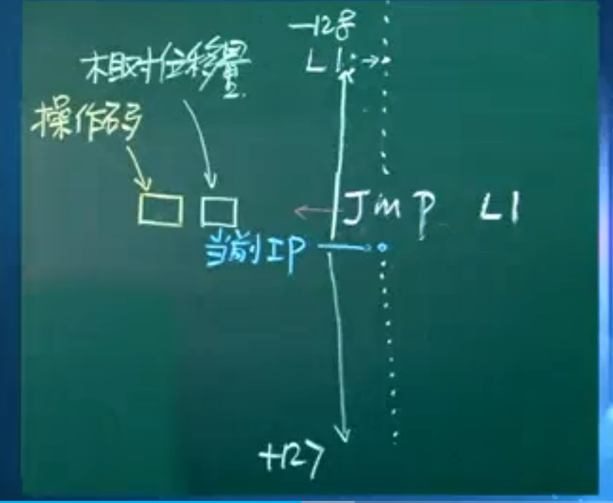
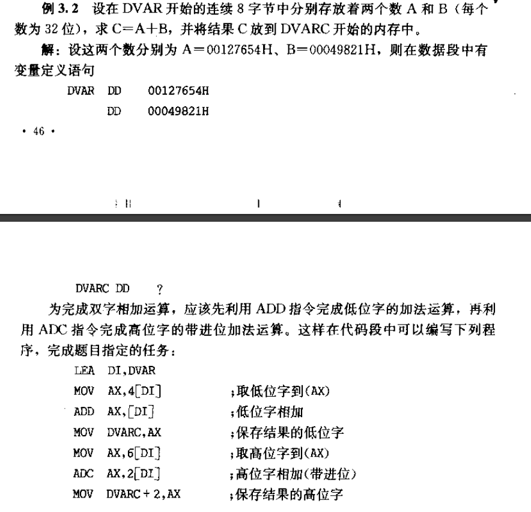
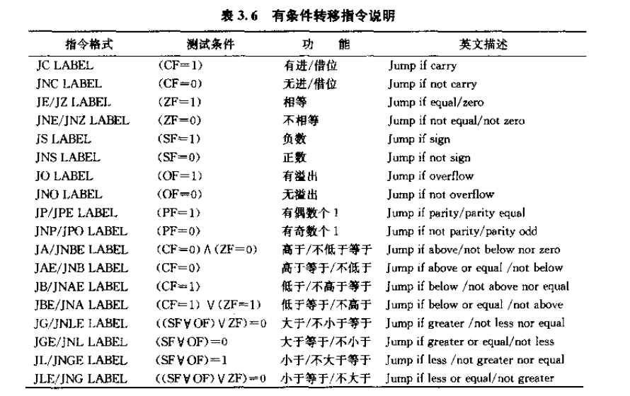
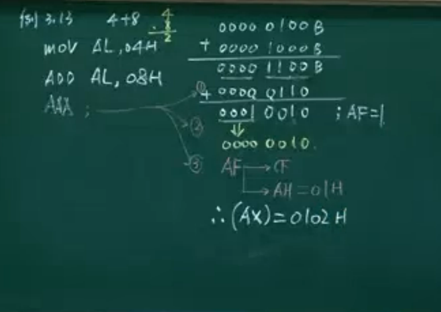
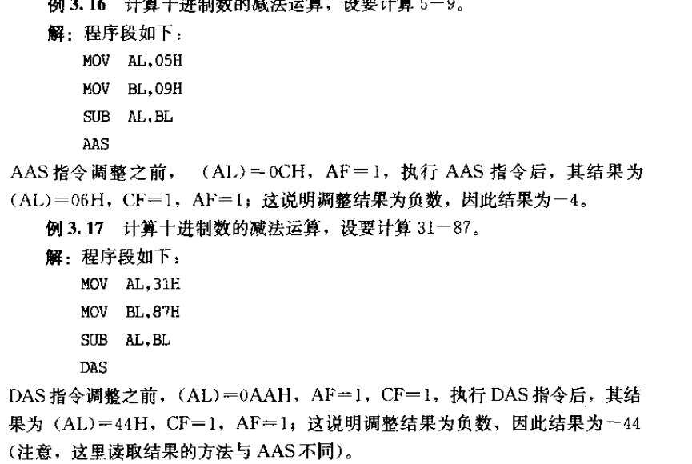
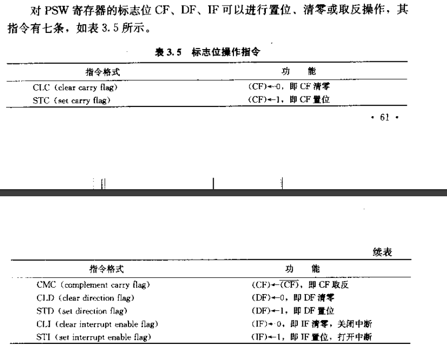

# 微机原理与系统设计笔记3 | 8086cpu指令系统

------

- 打算整理汇编语言与接口微机这方面的学习记录。本部分介绍8086的指令系统（一些与程序设计密切相关的如子程序调用指令放在下一部分）。

- 参考资料
  - 西电《微机原理与系统设计》周佳社
  - 西交《微机原理与接口技术》
  - 课本《汇编语言与接口技术》王让定
  - 小甲鱼《汇编语言》

------

## 1. 汇编语言指令

### 1.1 8086汇编语言程序中语句种类

1. 指令语句

   汇编后翻译为二进制代码，CPU可以执行的语句。

2. 伪指令语句

   CPU并不直接执行的语句，如上一篇笔记中提到的DD和DB。

3. 宏指令语句

   8086指令系统中没有的指令，是由用户**使用宏指令定义伪指令来自定义的新指令**。

### 1.2 汇编语言中语句的组成

（变量名、标号名：） 助记符 操作数 ;注释

- 变量名、标号名不一定有，两者都代表一个地址。
- ;后的是注释，不参加汇编过程，相当于C语言中的"//"
- 这部分不重要，老师只是在讲汇编的大体印象。

### 1.3 汇编语言中的常数及表达式

> 突然感觉还是这门课虽然评价很高，但还是一种知识清单式的讲解...

- 常数
  - 十进制常数、十六进制常数、字符常数、字符串常数、？（随机数）
- 表达式
  - 操作符—算术操作符、逻辑操作符、关系操作符、属性操作符、其他操作符
  - 这里有个汇编过程进行的计算和CPU执行的计算，挺好分辨的，前者就好是简单的计算式，后者需要CPU结构。

### 1.4 标号、变量与伪指令

标号在指令语句左侧，代表指令的地址，常用于指令跳转。

- 标号一旦定义，三个属性：

  - ```assembly
    NEXT:
    	......
    	JZ NEXT
    ```

    这里的NEXT就是标号。

  - 标号有三个属性（或者说信息）：

    1. 段地址属性`SEG`

    2. 偏移地址属性`OFFSET`

       > 前两者加起来其实就是标号代表此处的地址（16位），但是实际上经常会分别单独获取两个属性，比如获取偏移属性
       >
       > ```assembly
       > MOV BX,OFFSET NEXT
       > ```
       >
       
    3. 类型`TYPE`
    
       有两种，**NEAR近程**（段内转移，值为-1）和**FAR远程**（段间转移，值为-2）
    
       虽说TYPE有值，但是是在汇编过程中根据程序跳转的种类赋予的，自己写代码获取type值就并没有意义。
  
- 变量定义伪指令

  DB 定义字节型变量，DW 定义字型变量，DD 双字型变量

  - 变量定义后，具有5个属性

    1. 段地址 SEG
    2. 段内偏移地址（**经常使用**，OFFSET）
    3. 类型（DB=1，DW=2，DD=4，字节数）TYPE
    4. 长度 LENGTH
    5. 大小 SIZE

  - 在MASM汇编器中有一个`$` **16位**的位置计数器，在汇编过程中指向存储的位置。应用举例：

    ```assembly
    DATA1 DB 0CH,12H
    DATA2 DW $+2
    ```

    这里存储空间由低到高分别是0CH,12H和两字节的$+2，其值为0004H（高字节地址空间为00H，低字节为04H）

  - 一个注意事项——用变量定义来定义字符串时：

    - DB定义的字符串可以在存储器允许范围无限扩充

    - DD和DW定义字符串，单引号之间最多两个字符。

    - 字符数据定义举例：

      ```assembly
      DATA1 DB 'this'
      ;在存储器中为 't' 'h' 'i' 's'
      DATA2 DW 'AB'
      ;在存储器中为 'B' 'A
      ;这是因为前者是字节型，没有高低8位之分
      ```

  - 用变量定义变量：

    ```assembly
    DATAX DW DATA1
    ;也就是这个字单元存放DATA1的偏移地址
    ```

  - DUP操作符：重复操作符，允许嵌套

    ```assembly
    ;常规
    DATA5 DB 4 DUP(?)
    ;嵌套：课本P87-1.4
    BUF1 DB 7 DUP(5 DUP(55H), 10 DUP(F0H))
    ```

    表示4个字节单元（重复4次），其中的值是随机的。

  - 长度：在变量定义语句中，定义的变量的个数。如果出现DUP这种，最外层DUP左侧的数字就是个数，比如上面的嵌套就是7。

  - 大小属性:所有变量所占的总的**字节数**。SIZE=TYPE*LENGTH

- 属性操作符和 PTR 操作符

  - 属性操作符就是上面提到了的 SIZE TYPE LENGTH SEG OFFSET这些，不多介绍了。

  - PTR用于类型转化，是属性临时修改操作符（仅在PTR作用的语句中发生类型转换）。例子：

    ```assembly
    ;例子1
    MOV AX,DATA1;这不对，因为AX16位，DATA1是8位,所以应当转换为字变量：
    MOV AX, WORD PTR DATA1
    ;例子2
    MOV [BX],10H;这不对，因为不确定DS:BX对应的存储内容是什么形式的变量，有可能不匹配，汇编器不知道如何处理10H。
    MOV BYTE PTR [BX],10H
    ```


## 2. 8086指令分类

> 《微机原理与接口技术》P31，这部分属于查表。

- 数据传送类指令
- 算术运算类指令
- 逻辑运算类指令
- 移位类指令
- 标志位操作指令
- 转移指令
  - 有条件转移
  - 无条件转移
- 循环控制指令
- 子程序调用和返回指令
- 中断调用返回指令
- 字符串操作指令
- 输入输出指令
- 其他指令
- 宏指令

## 3. 数据与转移地址的寻址方式

这部分很熟悉了，这是指令集在设计之初决定的寻找操作数的方法。

### 3.1 数据寻址方式

- 立即数寻址

  - ```assembly
    MOV AX,1234H
    MOV WORD PTR [0200H],56H
    ;类型要明确:一方明确，双方都明确
    ```

    立即数只能做源操作数，且只能传送给存储器和通用寄存器，**不能直接给段寄存器**。

- 寄存器寻址

  - ```assembly
    MOV AX,DX
    ```

    源寄存器和目的寄存器的类型要一样。

  > 注意事项
  >
  > 1. 立即数不能直接放到段寄存器DS,SS等。
  > 2. CS IP不能当目的操作数。
  > 3. 堆栈必须按字操作

- 存储器寻址

  要寻找的操作数在存储器中。

  存储单元的段内偏移地址，又有五种方式给出
  
  1. 直接：
  
     如`MOV AL,[2000H]`，注意这里不需要PTR。实际使用过程中经常使用`MOV AL,DATA1`也就是变量来直接寻址。
  
     > - 存储单元之间不能互相直接操作数据。如果将data2处数据放到data1，需要AL这种通用寄存器来过渡。
     >
     > - 此外，寄存器->data1，需要考虑类型匹配：
     >
     >   ```assembly
     >   MOV DATA1,AX;错误
     >   MOV WORD PTR DATA1，AX;正确
     >   ```
  
  2. 寄存器间接寻址：
  
     只能用BX,SI,DI，如`[BX]`，具体语句：
  
     ```assembly
     MOV BX, OFFSET DATA1
     MOV AL,[BX]
     ```
  
     同理，寄存器间接寻址也存在一个类型问题：
  
     ```assembly
     MOV [BX],12H;×
     MOV BYTE PTR [BX],12H
     ```
  
  3. 寄存器相对寻址：
  
     BX BP SI DI + 8/16位偏移
  
     (有效地址的一部分在寄存器中），如`[BX]+1`这里的1是指偏移一个字节（一个存储单元）。等效为：`[BX]+3`和`3[BX]`
  
     > 这里BP默认是在SS段。用于不破坏栈顶指针的相对寻址栈中元素（也就是不出栈）。
  
     这里老师又融会贯通了：
  
     ```assembly
     MOV DATA1[BX],AL
     ;等效为 OFFSET DATA1+(BX),此时段寄存器取决于DATA1定义在的段，如果data1在DS段，则应为
     ;DS:OFFSET DATA1+(BX)<--AL
     ;也即，如果偏移disp是一个变量，那么就取它的OFFSET
     ```
  
  4. 基址 变址寻址：
  
     基址寄存器：BX BP； 变址寄存器： SI DI。
  
     如：`[BX][SI]`
  
     > 同理，BX默认DS，BP默认SS。
  
  5. 基址变址且相对寻址：
  
     3、4两种的组合。
  
- 隐含寻址

  - 隐藏目的操作数或源操作数的寻址方式，指令集默认指定。


### 3.2 转移地址寻址方式

- 段内转移

  只有IP发生变化。有两种寻址方式：

  - 段内直接寻址

    **直接给出转移到的地址**，这里还有一些细致的情况划分（但也合乎情理），老师讲解了三字节指令跳转和两字节指令跳转（这跟寻址范围有关）。

    > 这里提了一下短寻址，段内短寻址，意思是`jmp`到的目标地址并不在jmp前，而在jmp后，但程序设计者能够保证目标地址在当前ip后的127字节之内，此时可以用`jmp short DST`来寻址该指令后面的目标地址。而此时由于设计者保证其距离不超过127字节，所以此时这个指令语句仍为2字节，否则为3字节：
    >
    > - -128~0之内：2字节段内寻址
    > - $-2^{15}$ ~ -128, +127 ~ $2^{15}-1$：3字节段内寻址
    > - 0~127且有short短跳转标记：2字节段内寻址。
    >
    > 

    **CPU如何计算转移的目标地址**：转移位置的IP = 当前IP + DISP

    > DISP就在操作码后，区别是DISP放在一个字节里还是两个字节里。

    1. 8086指令系统中，所有的**条件转移指令**，只能在**段内转移**，且转移范围为当前IP为基准，范围为+128~-127；可以使用无条件转移指令搭桥，实现二级转移，达到更大范围的转移。
    2. 所有的条件转移指令，都是直接寻址。

  - 段内间接寻址

    使用寄存器或者存储单元来存放段内地址。

    ```assembly
    MOV BX OFFSET L2;
    JMP BX;
    ...
    L2:...
    
    ;;;;或者
    TABLE DW L2
    JMP TABLE
    ;或者L2先放到BX里再放到TABLE里再jmp
    ;此例一开就跟前面接起来了，方式就多了去了
    MOV BX,OFFSET TABLE
    JMP WORD PTR [BX]
    ```

- 段间转移

  8086不涉及，不过我记得386就涉及了，但我们老师也说非重点，先不操心这个了。

## 4. 传送类指令


1. 除了标志传送指令SHAF和堆栈操作指令POPF外，其余传送指令不影响状态标志。
2. 语法规则：
   1. 立即数只能做源操作数
   2. 类型要一致
   3. 类型要明确
   4. DS SS ES 做目的操作数时，立即数不能做源操作数
   5. CS、IP不能做目的操作数
   6. 两存储器单元之间不能互相操作，指令语句中两变量也不能直接运算

### 4.1 通用传送指令

```assembly
MOV DST,SRC
```

### 4.2 取有效地址指令

```assembly
LEA REG16，MEM
;将源操作数的有效地址放到16位寄存器中，为了方便使用，REG16最好使用BX BP SI DI
MOV BX,OFFSET DATA1
;等价于下面
LEA BX,DATA1

;但要与下面这个语句区分开
MOV BX,DATA1;这个意思是将DATA1处内容放到BX
;此时data1处类型不明确，所以
MOV BX,WORD PTR DATA1
```

### 4.3 取地址指针指令

不是很常用。

```assembly
LDS REG16,MEM
;将双字变量MEM内容高16位放入DS，低16位放入REG
LES REG16,MEM
;将双字变量MEM内容高16位放入ES，低16位放入REG
```

注意，这里的REG不能是段寄存器，放几个合法的实例：

```assembly
TABLE DB 10H,20H
POINT1 DD 02001000H
POINT2 DD TABLE

LDS DI,POINT1
;DS<-0200H,DI<-1000H
LES SI,POINT2
;ES<-TABLE段地址,SI<-TABLE偏移地址
LDS BX,[SI]
LES DI,[BX-5]
```

### 4.4 标志传送

```assembly
LAHF;(AH)<--PSW寄存器的低8位
SAHF;PSW寄存器的低8位-->(AH)
```

隐含寻址了，因为默认指定。

### 4.5 数据交换指令

```assembly
XCHG DST,SRC
```

可以完成两个操作数之间的数据交换：

- 不能使用段寄存器
- 不能完成存储器单元之间交换

### 4.6 字节转换 

```assembly
XLAT;(AL)<- (DS: (BX)+(AL) )
;将有效地址为 (BX)+(AL)存储单元的内容放入AL，如果输入AL，输出AL就是转换后的结果，这就是按字节转换：
MOV AL,4
LEA BX,TABLE
XLAT
;完成的工作就是将AL的内容4改为TABLE中的偏移量为4处的内容，相当于查表了。
```

### 4.7 堆栈操作

```assembly
PUSH SRC;
POP DST;
PUSHF;
POPF;
;必须按字操作
```

## 5. 算术运算类指令

- CPU执行运算类指令，就会影响状态寄存器
- 段寄存器不能参加运算。

### 5.1 加法指令

有三种。

```assembly
ADD DST,SRC; DST<--DST+SRC
ADC DST,SRC; DST<--DST+SRC+CF
;ADD和ADC均影响6个标志位
INC DST;DST增1，放到DST
;根据结果设置除了CF以外的5个状态标志,一定注意
```
**注意，INC的操作对象可以是存储器，简直不要太简洁**
一个例子，不想打字了，是老师讲过的双字变量如何相加（当时在学校没有好好听）。




### 5.2 减法指令-跳转指令

有5条。

```assembly
SUB DST,SRC; DST<--(DST)-(SRC)
SBB DST,SRC; DST<--(DST)-(SRC)-CF
;SUB和SBB均影响6个标志位
DEC DST; DST-1放回DST
;根据结果设置除了CF以外的5个状态标志
CMP DST,SRC ;DST-SRC，结果不放回，直接设置状态寄存器，常用于比较-条件-跳转
```

这个CMP单说没什么意思，它总是配合**跳转指令**形成if-else的汇编语块：



表里指令太多，基本上常用的也就`JZ` 。后面的JA/JNBE是**无符号数**的高低比较。JG/JNLE是**有符号数**的高低比较。

最后一条减法指令是求负指令

```assembly
NEG DST;取负并设置6个状态寄存器
```

### 5.3 乘法指令

```assembly
;无符号数乘法：
MUL SRC
;有符号数乘法：
IMUL SRC
;SRC不能是立即数
```

- 如果SRC字节型，DST在AL中，两者运算结果放在AX中（AH:AL）
- 如果SRC字型，DST在AX中,两者运算结果放在DX:AX中
- **无符号数乘法**只影响CF OF，如果CF OF同为0，则高位为0（AH或DX）；相反同为1，高位有有效积。
- **有符号乘法**如果CF OF同为0，则高位积无效（AH或DX），也即高位是低位的符号扩展：如果AL符号为负，则AH为8个1。同为1，高位有有效积。


### 5.4 除法指令

```assembly
; 无符号除法
DIV SRC
; 有符号除法
IDIV SRC
```

- SRC不能是立即数
- 无符号字节除法：DST是AX，运算结果的高低位分别放到AL和AH中。
- 无符号字除法：DST高低位分别放在DX AX，运算结果的高低位分别放在DX AX。
- 有符号数除法：**余数正负与被除数相同**。商正常运算，结果放到的位置与上述相同。

### 5.5 符号扩展指令

在一些运算中，为了使类型一致而设计的指令，比如a*b+c，a乘以b之后就32位，c需要扩展。

```assembly
CBW ;AL扩展到AX中，AH是AL符号位的扩展
CWD ;AX扩展到DX中，DX是AX符号位的扩展
```

### 5.6 BCD数调整指令

这部分我是不太熟悉的，老师不是很常提这个，BCD以及组合BCD、分离BCD，见**[笔记1](https://www.cnblogs.com/Roboduster/p/17062593.html)的3.6节**。

- 加法BCD数调整

  ```assembly
  ;加法组合BCD码调整
  DAA
  ;加法分离BCD码调整
  AAA
  ```

  都是对 AL 进行调整。

  举例：56+73=129

  ```assembly
  ; 组合
  MOV AL,56H ;01010110
  ADD AL,73H ;01110011
  ;现在结果：C9H 1100 1001
  DAA ;组合加法BCD码调整
  ; 1 0010 1001;也就是129
  ```

  分离BCD的例子：

  

  分离BCD 的调整比 组合BCD 麻烦。

  此外，解释一下AAA(*ASCII Adjust for Addition*)，为什么会有ASCII呢？原因就是上面图中的第二步：ASCII的'4'和'8'相较于04H和08H的区别在于高四位的末两位为1，相加之后高4位为0110，而第二步仍然清0，然后第三步就与上图一致。

- 减法BCD数调整

  ```assembly
  ;减法 组合BCD调整：
  DAS ;有借位则-6
  ;减法 分离BCD调整：
  AAS
  ```

  例子：

  

- **乘法分离BCD码调整**

  ```assembly
  AAM ;对MUL的运算结果进行调整
  ;只影响ZF SF
  ```

  例子在课本3.18，不贴了，理解就行。

- **除法分离BCD码调整**

  ```assembly
  AAD ;除法分离BCD码，先调整后运算DIV
  ; AH*10 + AL --> AX
  ```


## 6. 逻辑运算指令

- CPU执行运算类指令，就会影响状态寄存器
- 段寄存器不能参加运算。


1. 逻辑与指令

   ```assembly
   AND DST,SRC
   ```

   CF=0,OF=0,其余状态位正常设置

2. 逻辑或指令

   ```
   OR DST,SRC
   ```

   CF=0,OF=0,其余状态位正常设置

3. 异或运算

   ```assembly
   XOR DST,SRC;
   ```

   CF=0,OF=0,其余状态位正常设置

4. 逻辑测试指令

   ```assembly
   TEST DST,SRC
   ```

   两者与但结果不放回两个寄存器，仅设置状态寄存器。

5. 非运算指令

   ```assembly
   NOT DST
   ```

   不影响六个状态标志

## 7. 移位类指令

无符号数移动就是逻辑移位，有符号数是算术移位。正常设置除AF外的5个标志。

1. 逻辑移位

   - 逻辑右移

     ```assembly
     SHR DST,CNT
     ;cnt=1时可以写出来，如果>1则放到CL中
     ```

   - 逻辑左移

     ```assembly
     SHL DST,CNT
     ;cnt=1时可以写出来，如果>1则放到CL中
     ```
     
     SHL（左移）指令使目的操作数逻辑左移一位，最低位用 0 填充。**最高位移入进位标志位**，而进位标志位中原来的数值被丢弃

2. 算术移位

   - 算术右移

     最高位不变，最高位移动到次高位其余位向右移动，最低位移到CF

     ```assembly
     SAR DST,CNT
     ```

   - 算术左移

     **最高位变了**，全部位左移，最高位交给CF。

     ```assembly
     SAL DST,CNT
     ```

3. 循环移位

   只影响OF，其他位不定义

   - 不带CF的

     - 左移：

       ```assembly
       ROL DST,CNT
       ```

     - 右移：

       ```assembly
       ROR DST,CNT
       ```

   - 带CF的循环

     - 左移

       ```assembly
       RCL DST,CNT
       ```

     - 右移

       ```assembly
       RCL DST,CNT
       ```


> - 这个老师每个指令都要举例，刚想说循环移位有啥用，例子就给了我震撼。
> - 41讲的指令系统实在太多了，吐了。

## 7. 标志位操作指令

七个。



重要的是CLI和STI，这个经常用，老师这里跳过了，微机里也不会使用这个的。


## 8. 转移指令

段内转移指令在5.2部分讲了，这里就只看**段间的转移指令**。

```assembly
;===直接寻址:===
JMP FAR PTR ABC
...
ABC:...
;汇编成操作码(1字节)+OFFSET ABC(2字节)+SEG ABC(2字节)

;===间接寻址:===
;定义DS段
TABLE DD ABC;OFFSET ABC:SEG ABC---->地址指针
;定义代码段1
//JMP TABLE
LEA BX,TABLE
JMP DWORD PTR [BX];需要双字,包含OFFSET和SEG
;定义代码段2
ABC:...
```

## 10. 循环控制指令

- LOOP 标号

  - CX-1再放回CX，不影响标志寄存器
  - 如果CX≠0，继续跳到标号处执行，否则向下运行

  > p43看完转p65，看到p67之后再转p44。

- LOOPZ(LOOPE) 标号

  - CX-1再放回CX，不影响标志寄存器

  - 若CX!=0**并且**ZF==1，转移到标号处

    适合在指定区域中查找不同的字符，如果找到不同的，会退出循环。

- LOOPNZ(LOOPNE) 标号

  与上一个相反，CX!=0并且ZF=0时跳转到标号，适合找指定的字符，找到则退出循环。

- JCXZ 标号

  若 CX == 0，转移，测试cx开始时是否为0.


