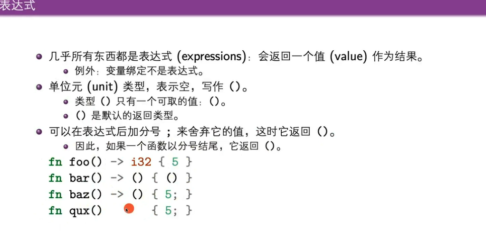

# Rust学习笔记1 | 基本介绍

跟随课程：

* [清华大学计算机系程序设计训练（Rust）》课程](https://lab.cs.tsinghua.edu.cn/rust/)
* [Rust 程序设计语言 简体中文版
  ](https://kaisery.github.io/trpl-zh-cn/ch02-00-guessing-game-tutorial.html)

> 实际上前者课程是按照后者这本书来讲的。

## 1. 学习目的

* 前导课程：程序设计基础（C）、面向对象程序设计基础（C++）
* 后续课程：
  * 软件工程：系统设计、项目管理、团队合作
  * 操作系统：计算机系统结构的设计与实现。
* 目标
  * 学习Rust的语言特性和库的功能，能够编写一定规模的程序。
  * 体会Rust语言的设计理念，与其他语言（C、C++）对比感受语言的设计理念。
  * 提升编程任务的实现能力。
* 学习内容：
  * 基本语法
  * 所有权和结构化数据
  * 标准库
  * 泛型、特型和生命周期
  * 项目管理和常用库
  * 输入输出与网络通信
  * 并发编程
  * 高级特性与编程语言综述
* 开发环境：
  * 工具链：Rust
  * 本地开发工具：vscode + rust-analyzer插件
  * 在线平台：Rust Playground（可以通过链接在线交流）
* 参考资料：
  * 我的参考：[路线](https://github.com/rcore-os/rCore/wiki/study-resource-of-system-programming-in-RUST#%E5%AD%A6%E4%B9%A0%E6%96%B9%E6%A1%88%E5%85%AD)

## 2. Rust语言概述

* rust语言的目标：构建可靠且高效的软件，语言特性如下：
  * **高效**：没有运行时和垃圾收集器，代码运行速度快，内存利用效率高，可以用来开发对性能要求高的服务。
  * **可靠**：用 **类型系统** 和 **所有权模型** 确保内存安全性和线程安全性，在编译时消除各种潜在的问题。
  * **好用**：文档丰富、编译器友好（给出的错误提示很好），工具集一流。包含：集成的包管理器和构建工具、支持各种编辑器的代码自动补全和类型查看功能、代码自动格式化工具等。
  * **使用场景**：命令行工具，网页应用、网络服务、嵌入式开发。
* Rust编写的软件：
  * Rust语言工具链
  * Servo浏览器引擎
  * Redox操作系统
  * Linux 已经许可Rust语言加入内核开发
  * exa、bat、fd等命令行工具（替代的是 ls、cat、find）
  * rCore教学操作系统
  * MadFS文件系统（性能很高）

## 3. 第一个Rust程序

Hello World程序：

```rust
// hello.rs
fn main() {
    println!("Hello, world!");
}
```

> 涉及的知识基本有：
>
> * 函数定义
> * main函数
> * 输出（以叹号结尾，是一个宏调用）
> * 字符串
> * 编译与运行

用 `rustc hello.rs`运行一下，用 `./hello`运行。得到 Hello, world! 输出。

## 4. Rust项目管理

多文件、多依赖系统如何管理呢，这其实是C系语言的一个痛点，Makefile就是一个针对C系语言多文件多依赖工程的管理工具，而Rust对应的包管理工具就是Cargo。

### 4.1 Cargo

所以尝试写一个用Cargo管理的小项目，这个项目里：程序将会随机生成一个 1 到 100 之间的随机整数。接着它会请玩家猜一个数并输入，然后提示猜测是大了还是小了。如果猜对了，它会打印祝贺信息并退出。

* Cargo新建项目：

  ```rust
  cargo new guessing_game

  cdguessing_game
  ```

  * Cargo.toml文件是一个项目描述文件。记录项目名字、项目版本号、Rust版本号、依赖项。
  * src文件夹下是源代码。
* Cargo运行项目：`cargo_run`，自动进行编译并运行项目，可以快速迭代程序，如果只需要进行编译，可以使用cargo build。

猜数字程序如下：

```rust
use std::io;

fn main() {
    println!("Guess the number!");
    println!("Please input your guess.");

    let mut guess = String::new();
    io::stdin()
        .read_line(&mut guess)
        .expect("Failed to read line");

    println!("You guessed: {guess}");
}
```

> 这里我遇到了一个问题，那就是如何在一个大目录下创建cargo项目，起初创建的项目虽然能够编译运行，但是无法跳转指令等等，我感觉不大对劲。后来发现analyzer解析找不到路径。才发现，当前路径距离cargo项目隔着两层，所以rust-analyzer就解析出现了问题。将结构摆放正确后就没问题了。

### 4.2 Rand包

Rust将最最核心的放在标准库，将其他不太重要的都交给第三方库，而第三方库可以通过Cargo下载。比如随机数相关的库，rand，引入只需要在Cargo.toml的依赖项中写入 `rand="0.8.3"`，编译时就会自动下载这个库、编译、并导入。这一点比C++方便很多，也比python更优秀。

> 这里指定rand的版本号，是出于软件工程的考虑，使自己的代码更易维护。

## 5. 基本语法

### 5.1 let变量绑定

let进行变量绑定，不是赋值！！可以不用指定类型，也可以自己指定。默认变量不可变，

如果要让变量可变，需要使用mut。

绑定可以被掩盖，也叫隐藏、重影。更像是智能指针。和常量的区别：

* 常量：编译时是常数，在编译时就可以确定的值。可以出现在任何作用域，可以提前使用
  ```rust
  const PI:f64 = 3.14159;
  const MAGIC: i32=42;
  ```

### 5.2 表达式

几乎所有都是表达式，会返回一个值作为结果。但变量绑定不是表达式。()就像void，是默认返回值。



分号的意义跟传统语言有点区别。


### 5.3 基本类型

数值类型更细分，避免编译器方面的困难


### 5.4 数组

变量+长度


### 5.5 切片

&也有新意义


### 5.6 字符串


### 5.7 元组

### 5.8 向量

类似于C++的std::vector JAVA中的java.util.ArrayList

在类型前写 &表示引用类型：&i32

用&来取引用（与C++类似），用*来解应用（和C++类似）

在Rust中，引用保证是和合法的，合法性会在编译器编译时检查。（有不安全的机制，但此时编译器不保证正确性了）

引用的声明周期比较复杂

https://blog.csdn.net/qq_28687433/article/details/113955315
