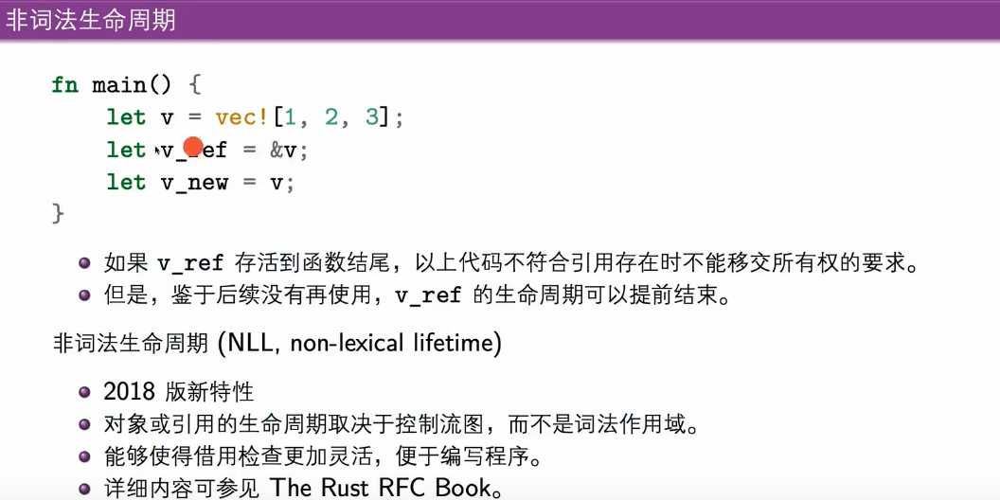

# 学习笔记2 | 所有权和结构化数据

2023/03/28 做了30道Rustlings，感觉这种题库真的很棒。做到结构化数据、引用和借用部分明显感觉吃力，所以还是回来继续听课。

所有权是Rust语言最特别也是贯穿始终的概念，结构化数据也是一门语言很重要的概念。

## 1. 所有权

### 1.1 资源管理的需求


而管理内存的方式，是需要编程语言来提供一定的支持的，C语言中的分配比较初始，C++中已经作出了一些努力，分配、释放内存结合构造函数、析构函数避免了一些问题


移动构造，在语义上将一个对象的资源转移给另一个，比如C++的std:string（这个我在学C++的时候没什么概念......）

Rust引入了所有权这个概念，这是这门编程语言的新特性，所有权是显性的。

所有权在编译时检查，运行时开销很小。所以初学者经常碰到Rust编译器的**借用检查器**返回来的问题。

Rust的每一个值都有一个所有者。同一时刻只能有一个所有者，当所有者失效的时候，值也会被丢弃。


移动语义：


> C++和Rust所有权的比较:
>
> * https://blog.csdn.net/quicmous/article/details/113916168
> * C++这里具体不叫所有权，而是移动语义，搜索所有权都会是Rust相关的，而C++中叫做移动语义 move：https://www.cnblogs.com/sunchaothu/p/11392116.html

C++的移动语义例程代码如下：输出的str1将会是空串，str2将会是str1被初始化的值。

```c++
#include <iostream>
using namespace std;
int main(){
    // int vec1[3] = {1,2,3};
    // int* vec2 = vec1;
    // cout << vec1 << vec2;
    string str1 = "sdfsdf";
    string str2 = move(str1);
    cout << "str1: " << str1 << endl << "str2: " << str2;
}

```


哈哈哈笑死，借用的前提是所有权得有，比如B向A借用所有权，而之后C又直接拿走了A的所有权（A把所有权移交了），那么B也失效了。所以规定一个变量的引用存在时，不能移交它所绑定的数据的所有权。如下图所示：


但是Rust现在：下图前三行代码是可以编译通过的，因为v_ref后面没有使用，可以认为v_ref的生命周期就是到这里为止。也就是NLL机制。



有了借用之后，Rust的函数就可以这么写（用借用的形式）：


而如果以引用的形式传入函数，不能在函数里对这个引用进行解引用绑定：


自动解引用：显式解引用有两种情况。但这两种情况基本可以按照C语言来理解。什么时候加什么时候不加，可以根据编译器反馈来判断...笑死（面向编译器）


dfgdfg

* 引用的内在逻辑：
  * 不能在某个对象不存在后继续保留对它的引用
  * 一个对象可以同时存在多个不可变的引用
  * 或者仅一个可变引用
  * 以上两者不能同时存在。

> 考虑迭代器的场景：


