# 信号与系统笔记1 | 信号与系统的基本概念

------

这学期开了一门"信号与系统分析"，一直有对电信有所向往的我想要好好学习这门课，所以找了网课来自主学习。希望能够如此前微机和操作系统一样听完总结完。

- 参考课程1：[信号与系统-浙江大学-胡浩基](https://www.bilibili.com/video/BV1g94y1Q76G/?p=2&spm_id_from=pageDriver&vd_source=4a83c831c5458c234bb7ce23c54c2b63)，资料比较全，且新，所以打算主要就这门课做笔记。

- 参考课程2：[信号与系统-西安电子科技大学 郭宝龙](https://www.bilibili.com/video/BV1PZ4y1t7DA?p=3&vd_source=4a83c831c5458c234bb7ce23c54c2b63)，很有名，听过西电的微机，觉得电信的课都应该不错。

  该课程资料：http://ycit.ysepan.com/；https://8791.lanzoui.com/b00zi40ve

- 参考课程3&4：本校的计科专业的信号（翟正军）与系统与电信专业的信号与系统（秦雨潇）。

- 参考书籍：《信号与系统》奥本海默-第二版

- Github书开源网站：https://github.com/NIT2018/NitSignal

------

## 1. Signal & System

### 1.1 概述

- 信号：**表达、传递信息**的符号。如长城的烽火、书信、表情-动作-语言、**光电的变化**。

  > 信息：定义很多。“信息是用来消除随机不定性的东西。”——香农。香农还定义了信息量（信息论基于概率），概率大的信息信息量小。
  >
  > $信息量=-log_2[p(x)]$，比如p=1/2时，信息量=1，可以用一个比特来表示（0和1）。
  >
  > $信息熵 = -\sum_{x\in X}p(x)log[p(x)]$，也就是说$==E[-log p(x)]$

  同样，传递信息的方式，就可以：写信、带话、写电子邮件、打电话等。这些传递信息的方式有优劣吗？

  - 由目的而定。一般倾向于不需要媒介、成本低、简单简洁、传输速度快、传输可靠。
  - 综上，光和电是传递信息很好的方式。这也是电信研究的重点。当然，并不是普适的。老师举了很多有意思的故意违背上述情况的信息传递的机制

- 系统：**有输入，有输出**

  - 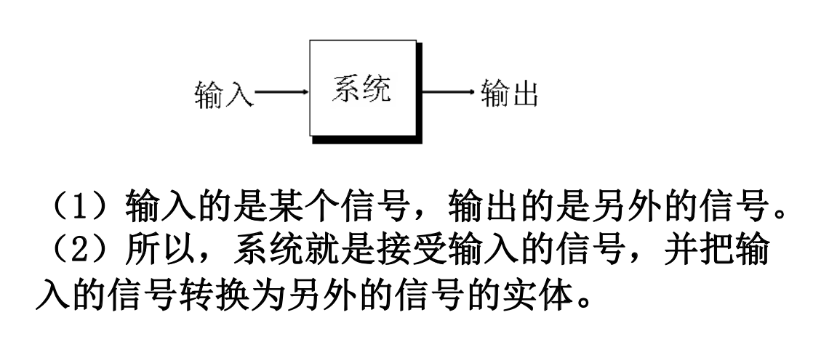
  - 比如人也可以当做系统。金融系统。电信专业做的所有事情，都可以归结到：**产生信号--设计系统--输出新的信号。**
  - 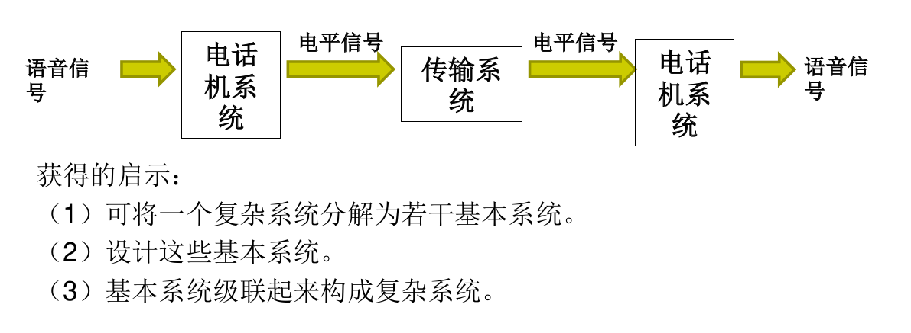

- 所以本课程的学习内容：

  1. 研究如何**产生**成本低、简洁、传输速度快、可靠的信号，这样的信号有哪些特点和性质。
  2. 还要重点学习**系统的基本知识和基本方法**。
     - 设计系统：针对某种输入信号，**设计**系统，将它转换为满足需求的输出信号。
     - 研究系统：对于输入系统的某信号，估计和**预测**此信号通过此系统后的输出信号的特点和性质。

### 1.2 信号的分类

- 声音**按维度的分类**：

  - 一维：声音。
  - 二维：图像信号（X,Y），图像中每个点都是RGB三原色，现代图像每个颜色分量用8bit编码，取值0~255，RGB共24位。看到的是一个图，计算机里是红黄蓝三个矩阵。
  - 三维：视频信号（X,Y,T），深度图（RGBD）
  - 四维：VR看到的三维场景+时间
  - ....到N维

  在信号与系统中，只讨论一维的信号，高维信号在其他课学习。

- 一维信号的两种形式**连续和离散**：

  - 信号按照自变量取值是否连续分为连续时间信号和离散时间信号。
  - 连续时间信号：在任何时刻除了若干个不连续点外都有定义的信号，表示方法是$x(t)，t\in R$
  - 离散时间信号：表示方法$x[n],n\in Z$，取整数只是为了表达方便。

- **周期信号和非周期信号**：

  - 周期信号：信号随时间变量t或n变化，具有重复性，T N为最小正周期。
    $$
    x(t)=x(t+mT),m\in Z \\
    x[n]=x[n+mN],m\in Z,
    $$
    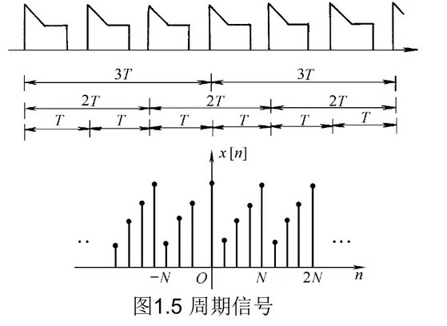

- **奇信号和偶信号**：

  - 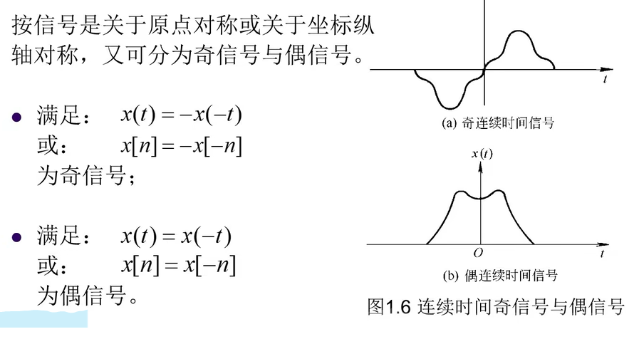

  - **任何信号分解为奇信号和偶信号的和。并且拆解唯一。**连续、离散都适用。

    

- **功率信号和能量信号**：

  - 有关信号的功率和能量：

    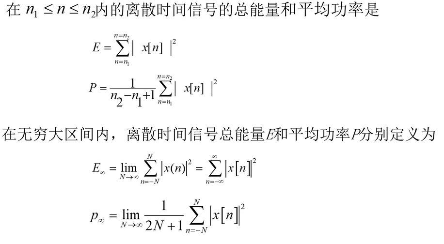

    相应的，连续信号的总能量和平均功率应当为：
    $$
    E=\int_{t0}^{t1}|x(t)|^2dt\\
    P=\frac{1}{t1-t0}\int_{t0}^{t1}|x(t)|^2dt
    $$

  - 能量有限信号：上述表达式中能量E有限

  - 功率有限信号：上述表达式中功率P有限
  
  > 这里浙大的课程没有强调（也可能电信不强调），我校的课程中这里是一个考点。

### 1.3 基本的连续时间信号

> 电路的时候学过。

- 单位阶跃信号

  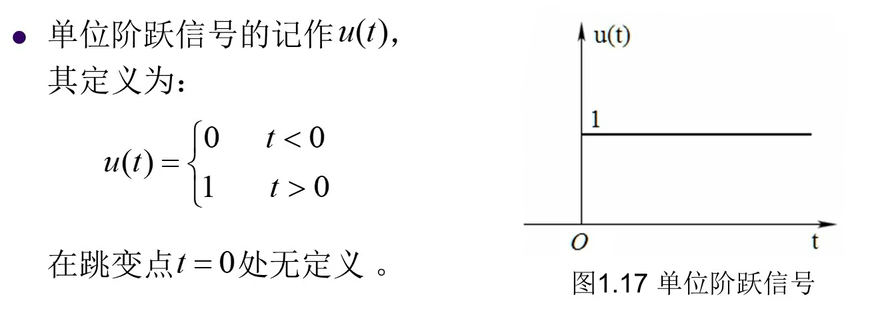

  u(0)可以为任意的值，这个问题在后续会详细说明其意义。u(t)的一个物理意义是电路的开闭。

- 冲激信号

  也叫奇异信号，因为其在0处为 **无穷大**
  
  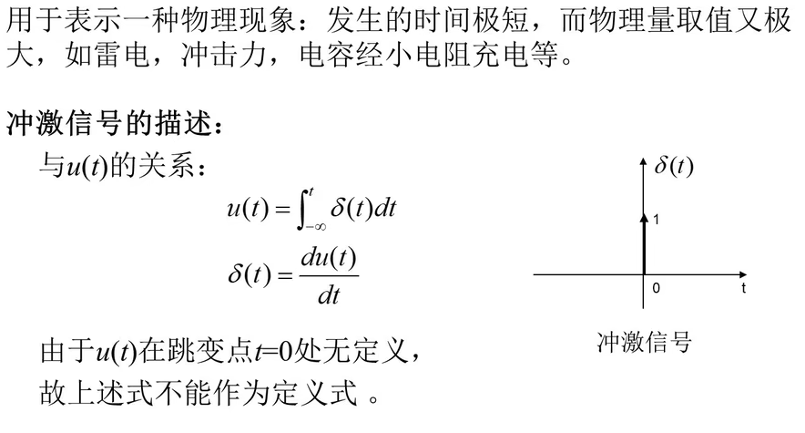

**其他连续时间信号：**

- 抽样函数S(a):  **※重点※**

  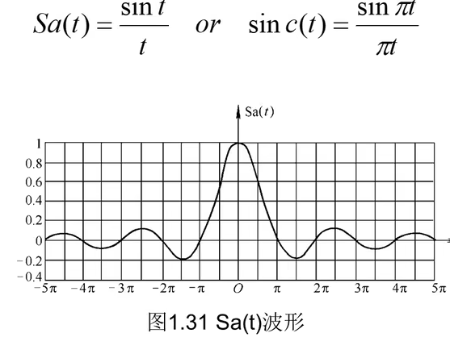

  更严格的定义是分段函数，t≠0为上式，t=0则为1。
  $$
  \lim_{t->0} \frac{\sin(t)}{t}=1
  $$

- **S(a)是偶函数**，因为是两个奇函数之积/商。

- 抽样函数的性质：（记住，第三章要用，不会推回去看复变）

  

  这里记推论：

  - $\int_0^\infty \frac{\sin(\omega t)}{t}=\int_{-\infty}^{0} \frac{\sin(\omega t)}{t}=\frac{\pi}{2}$，一个比较简单的证明：

    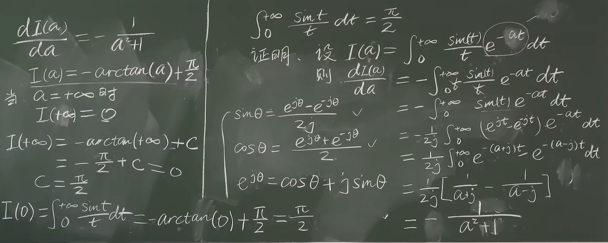
  
  - 关于这个函数的图像问题：留意它带不带ω的图像区别，带ω的图像最高点为ω。
  
    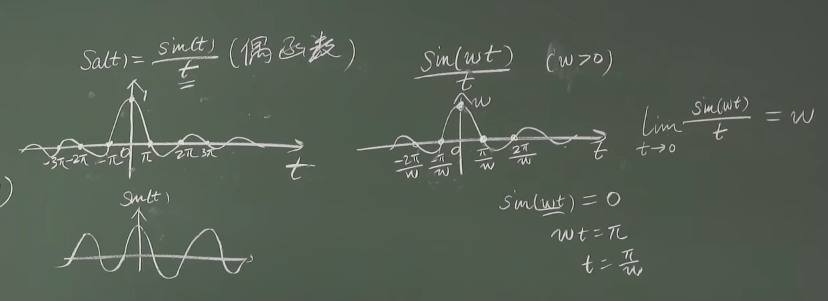
  
  > 绝了。学过数学分析的我也得跪下。

### 1.4 基本的离散时间信号

- 单位冲激序列

  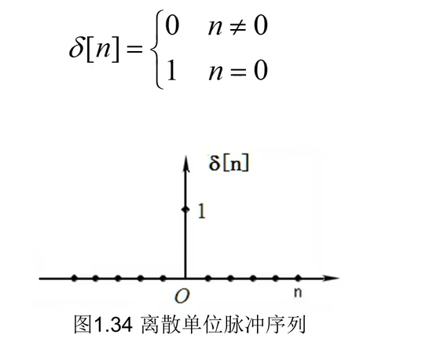

  **要跟连续的δ(t)--（奇异信号）区分开：**

  - $\int_{- \infty} ^ {+ \infty}\delta(t)=1$。之所以“奇异”在0处取值非常大（无穷大）。
  - 而δ[t]一点也不奇异，它只是一个单点。在0的时候=1。

- 单位阶跃信号

  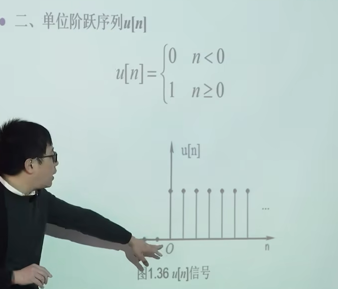

## 2. 信号的自变量变换

> 这部分我是先听了学校的课程后听的胡老师的课。胡老师的引入是**信号图像上点的变换带动整个图像的变换。**
>
> 就这个角度就比我校讲得好（直接背压缩和评平移的公式）......反正我当时在课上迷惑了一会儿。

### 2.1 口诀

这是一个考点，**做这类题目的四个口诀：**

- **化成标准形式**
- **前有负号翻转**
- **系数大于1，压缩；系数小于1，拉伸**
- **加号左移，减号右移**

放个例题：跟引入口诀的例题相比稍微有一点变化。

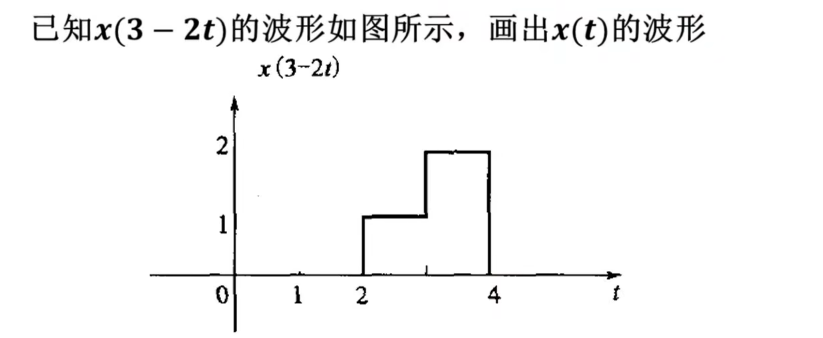

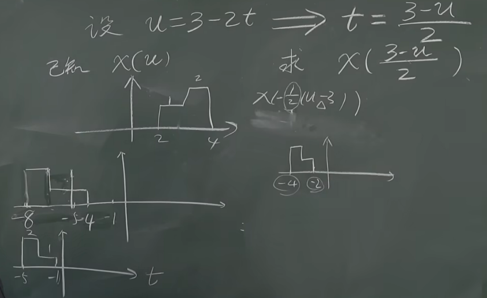

### 2.2 简单应用

上面这种题目的目的是为了形成对信号变换的最简单的直观认识。下面举了个方波的例子：

- 若要形成下图所示的方波，可以是两个连续阶跃信号的差。

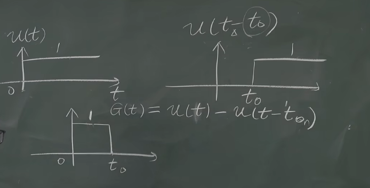

- 不过需要**注意离散信号的开闭区间**，比如u[n-3]，它的第一个非0信号为n=3。

  所以用**G[n]=u[n+2]-u[n-3]**时，得到的是**[-2,2]**的离散方波。

  同样，不仅要通过表达式来得到图像，根据图像也要合理反推出表达式。

  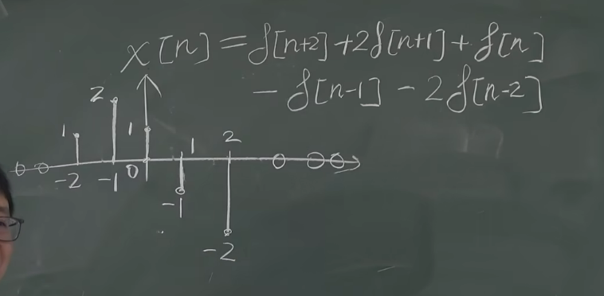

- 有一个公式：（在第二章会讲，但本质就是这一节信号移来移去的思想）

  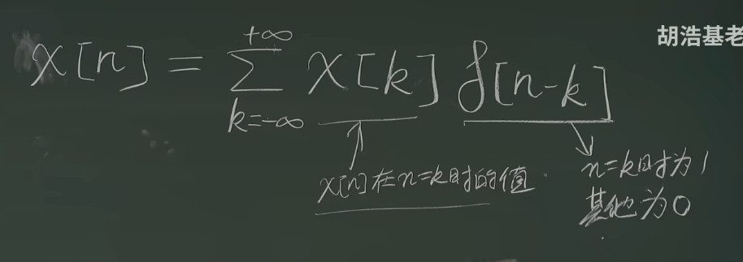

## 3. 系统的简介

### 3.1 系统分类

主要有以下几种：

1. 线性系统与非线性系统
2. 时不变系统（时变系统）
3. 因果系统（非因果系统）
4. 稳定系统（非稳定系统）
5. 无记忆系统（记忆系统）
6. 可逆系统（不可逆系统）

#### a. 线性系统

- 假设任意x(t)经过某个系统得到y(t)，则有：ax(t)经过系统得到 ay(t)，a为任意实数。 **齐次性**

- 假设任意x1(t)经过某个系统得到y1(t)，任意x2(t)经过某个系统得到y2(t)，则有 x1(t)+x2(t)经过系统得到y1(t)+y2(t)。 **叠加性**

- 若一个系统同时满足这两个条件（**齐次性和叠加性**），则为线性系统，否则就是非线性系统。

  > 举例：放大器是一个线性系统。
  >
  > 虽然他在定义上看起来只满足齐次性，但实际上叠加性也是满足的。

   例题1  输入为x(t)，输出为y(t)=tx(t)，问是否是线性系统：  **是**

  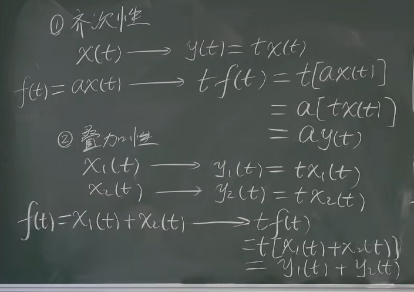

  例题2  输入为x(t)，输出为$y(t)=\frac{dx(t)}{dt}$，也就是微分器，是否是线性系统。 **是**

  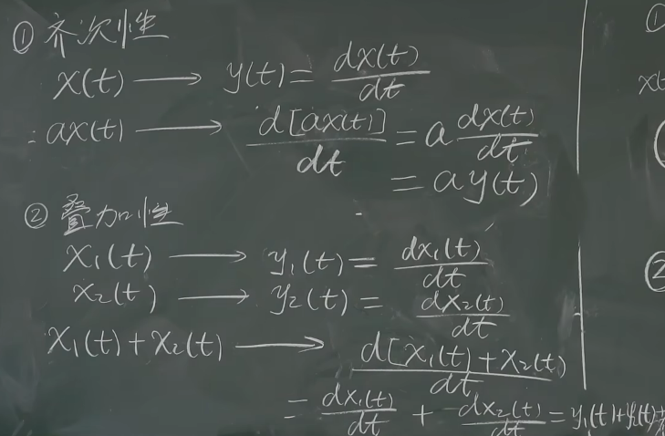

  同理，积分器$y(t)=\int_{-\infty}^t x(\tau)d\tau$也是线性系统。

  证明一个系统不是线性系统只需要举出一个反例。

  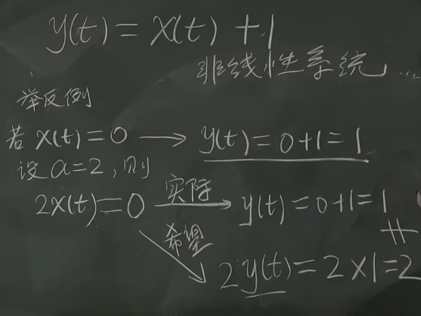

  思考题：y[n] = x[n] - x[n-1]离散微分器，也是线性系统。离散积分器$y[n]=\sum_{k=-\infty}^n x[k]$也是线性系统。

------

**线性系统判据：**

- 每一项都有x

- 每一项的x都是一次。

  > 如下图所示，前两个是线性，后两个是非线性。

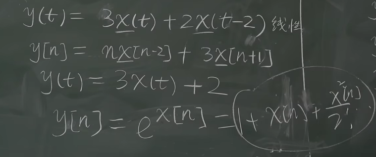

------

**思考题：请举出一个系统，只满足两个性质之一，不满足另一个性质。**

#### b. 时不变系统

若$\forall x(t)$，通过系统后，输出y(t)，则任意t0∈R，有$x(t-t_0)\rightarrow y(t-t_0)$。则该系统是时不变系统。

> 系统的输出不会随着时间的改变而改变。

例题1：

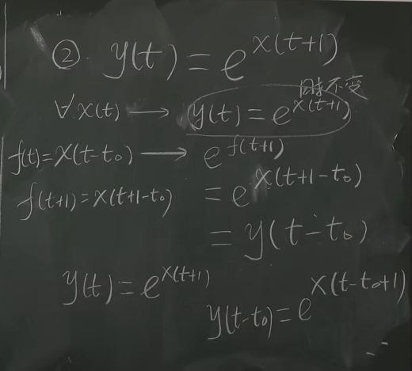

例题2：

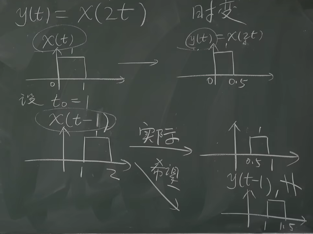

------

**时不变判断标准：**

- t 只在x的括号里
- t只能是t，不能是2t，-2t，t2
- 离散信号就是将t换成n

#### C. 因果系统

教材定义：如果一个系统任何时可输出只决定于现在和过去的输入，就称该系统为因果系统。

至于说非因果系统有何意义，物理学中的量子力学可能有这方面的内容。

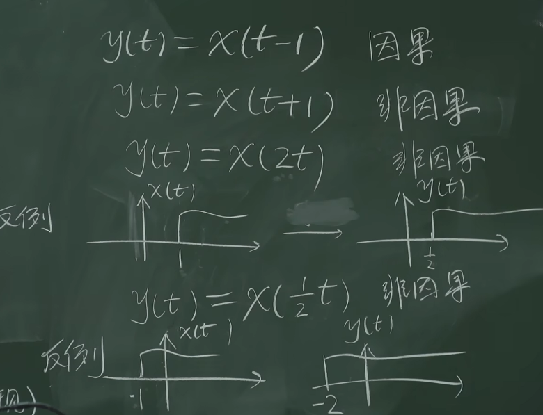

同理，y[n]=x[3-n]也是非因果。

------

**判据：x中字恒小于y中的数**

#### D. 无记忆系统

一个系统无记忆，是指y(t)的值仅依赖**x(t)**的值。

**判据：x与y括号中的数完全一样。**

可以判断，无记忆系统一定是因果系统。

#### E. 可逆系统

x(t)能唯一写成y(t)的形式，也就是可以写成反函数，或者说两者一一对应。比如$y(t)=x^2(t)$就不是可逆系统。

这里提一个：$y[n]=\sum_{k=-\infty}^nx[k]$是可逆的，其逆是$x[n]=y[n]-y[n-1]$。以及积分器是可逆的，微分器不是：

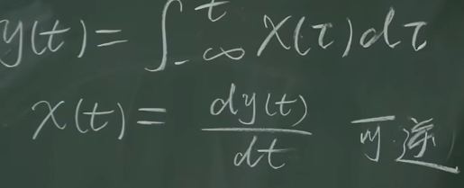

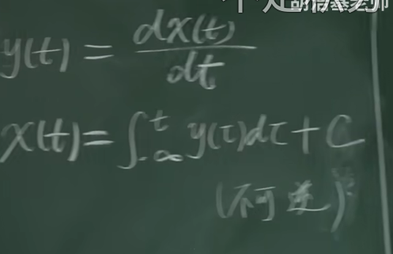

#### F. 稳定系统

若输入x(t)有界，则输出y(t)有界，就是稳定系统。

> 有界：
>
> $\exist M,对\forall t.有\lvert x(t) \rvert <M$

稳定系统举例：

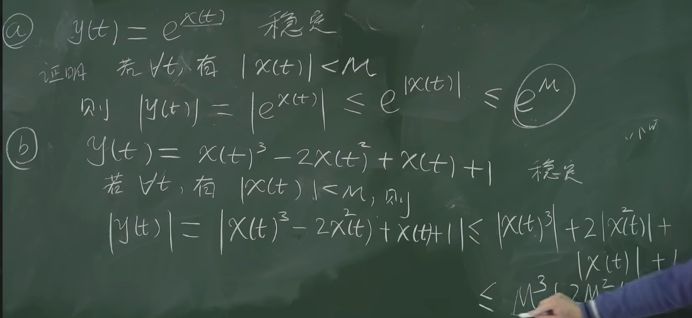

不稳定系统举例：

- 微分器和积分器

  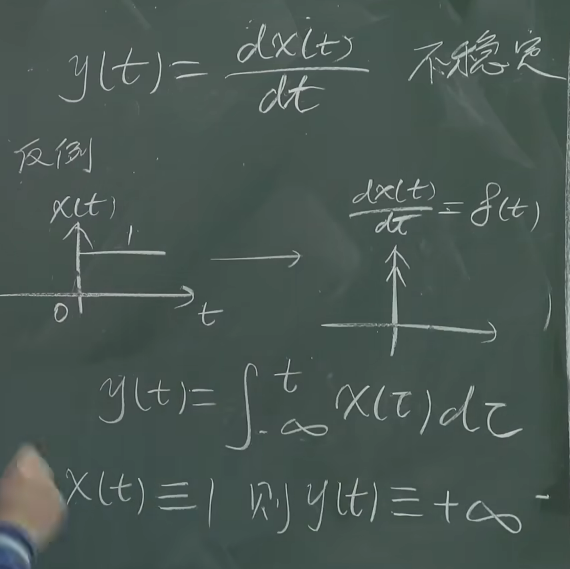

- 叠加器不稳定，但是离散的微分器稳定

  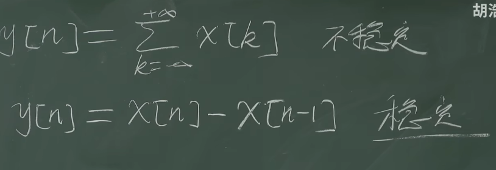

